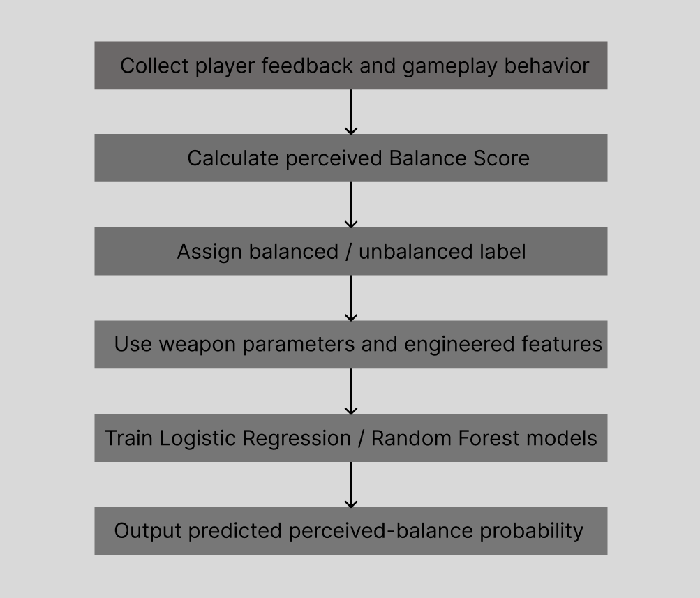

## Overview

This project explores how machine learning can support weapon balancing in game design. We developed a 2D top-down shooter prototype called **TopDownShooter**, where players could switch between four weapon types: rifle, sniper rifle, shotgun, and SMG. Each weapon had different design parameters, including damage, fire rate, range, projectile speed, spread, ammunition capacity, reload time, and critical chance.

The purpose of the project was not to create a universal or objective definition of weapon balance. Instead, we treated balance as a **player-perceived experience**. We first used questionnaire responses and gameplay behavior to construct a **Perceived Balance Score**, then trained machine learning models to predict whether a weapon configuration would be perceived as balanced based on its numerical parameters.

In this way, the project was a proof of concept for **data-assisted game balancing**: a workflow where player feedback, gameplay metrics, and machine learning are used to support design decisions during weapon tuning.

## Motivation

Weapon balance is an important part of player experience. If one weapon is too powerful, players may ignore other options and rely on a single optimal strategy. If a weapon feels too weak, slow, or frustrating, players may avoid using it entirely. Good weapon balance should support fairness, challenge, satisfaction, and meaningful decision-making.

However, weapon balance is difficult to evaluate from numerical parameters alone. A weapon with high damage may still feel balanced if it has a slow fire rate, limited ammunition, or long reload time. A weapon with many projectiles may feel satisfying, but it may also feel chaotic or unfair if its spread, range, or projectile speed is not tuned carefully.

This project addressed this problem by combining **subjective player feedback** with **objective weapon parameters**. Machine learning was used as a supportive tool to model the relationship between weapon statistics and perceived balance.

## Game Prototype

TopDownShooter is a 2D player-versus-environment top-down shooter. The player moves through rooms, defeats enemies, and tries to survive within a time limit. During gameplay, the player can switch between four weapons:

* Rifle
* Sniper rifle
* Shotgun
* SMG

Each weapon was designed around a different playstyle. The rifle served as a general baseline weapon. The sniper rifle emphasized high damage and careful shooting. The shotgun focused on multiple projectiles and spread. The SMG emphasized high fire rate and ammunition capacity, but lower damage per bullet.

The prototype was used as a controlled test environment for collecting gameplay data and player feedback about perceived weapon balance.

*TopDownShooter prototype used as the test environment for collecting gameplay data and player feedback.*

## Data Collection and Label Construction

A small-scale playtest was conducted with 13 participants. Each participant completed one playtest session in which they could use and switch between four weapons: rifle, sniper rifle, shotgun, and SMG. After gameplay, participants evaluated their experience with each weapon through weapon-specific questionnaire items.

This resulted in 52 weapon-level evaluations, calculated from 13 participants × 4 weapons. The questionnaire covered several aspects of player experience, including perceived challenge, fairness, enjoyment, effectiveness, achievement, and satisfaction with specific weapon attributes such as projectile speed, damage, range, ammunition, and reload time.

To use this feedback for supervised learning, we constructed a weighted **Perceived Balance Score**. This score combined:

* balance and fairness ratings,
* enjoyment and achievement ratings,
* satisfaction with weapon attributes,
* gameplay behavior such as weapon usage time and kills.

Weapons with high Perceived Balance Scores were labeled as **balanced**, while weapons with low scores were labeled as **unbalanced**. Samples in the ambiguous middle range were removed to make the classification task clearer. After preprocessing, 41 valid weapon-level records remained for modeling.

## Feature Engineering

The machine learning input features were based on weapon parameters and derived gameplay-relevant metrics.

The base weapon parameters included:

* Projectile speed
* Fire rate
* Damage
* Range
* Number of projectiles
* Spread
* Ammunition capacity
* Reload time
* Critical chance

Several derived features were then calculated to describe higher-level weapon properties:

* **Damage per second**, combining damage and fire rate.
* **Reload efficiency**, combining ammunition capacity and reload time.
* **Coverage**, combining projectile speed and range.
* **Spread load**, combining spread and number of projectiles.

These derived metrics helped represent weapon behavior more meaningfully than raw parameters alone. For example, damage by itself does not fully describe offensive strength, because a weapon's actual effectiveness also depends on how quickly it fires and how often it needs to reload.

## Machine Learning Approach

The prediction task was formulated as a supervised binary classification problem. The input was a set of weapon parameters and engineered features, while the output was whether the weapon was labeled as perceived balanced or unbalanced.

The machine learning pipeline included:

* data cleaning,
* questionnaire score normalization,
* Perceived Balance Score construction,
* removal of ambiguous middle-range samples,
* feature engineering,
* feature standardization using `StandardScaler`,
* model training and evaluation.

Two models were trained and compared:

* **Logistic Regression**, used as a simple and interpretable baseline.
* **Random Forest**, used to capture possible non-linear relationships between weapon parameters.

The models were evaluated using **three-fold stratified cross-validation**. The evaluation metrics included accuracy, ROC-AUC, F1-score, and confusion matrices.

*Machine learning pipeline: player feedback and gameplay behavior were converted into a perceived-balance label, which was then predicted from weapon parameters and engineered features.*

## Results

Within the collected dataset and the constructed Perceived Balance Score definition, both Logistic Regression and Random Forest achieved strong and similar performance. The models predicted whether a weapon would be labeled as perceived balanced with approximately 90% mean accuracy.

The high ROC-AUC score suggested that the relationship between weapon parameters and perceived balance labels was consistent within this dataset. However, because the dataset was small, these results should be interpreted as exploratory rather than fully generalizable.

The Random Forest feature importance analysis suggested that **projectile speed**, **number of projectiles**, and **spread** were among the most influential features. This matched intuitive game design expectations: these parameters strongly affect how responsive, powerful, or chaotic a weapon feels during moment-to-moment gameplay.

The trained model could also test on newly designed weapon configurations. For each new weapon, the model produced a balance probability score, showing how likely the weapon was to be classified as perceived balanced under the learned model.

*Random Forest feature importance suggested that projectile speed, number of projectiles, and spread were among the most influential features for predicting perceived weapon balance.*

## Discussion

This project demonstrates how machine learning can support game balancing as a design-assistance tool. By combining player-centered feedback with measurable weapon statistics, designers can gain early insight into whether a weapon configuration may feel fair, satisfying, or overpowered.

One important insight is that perceived weapon balance is not only about raw damage. Features related to immediate interaction feel, such as projectile speed, projectile count, and spread, appeared to strongly influence the model's predictions. This suggests that players may judge balance through moment-to-moment control and responsiveness, not only through long-term numerical efficiency.

At the same time, the project has several limitations. The balance label depended on a weighted Perceived Balance Score that we designed from questionnaire responses and gameplay behavior. Therefore, the model learned to predict this operationalized version of perceived balance rather than discovering an objective or universal definition of weapon balance.

The dataset was also small, with 13 participants and four weapon types. The model was not externally validated with new players, more weapons, or different enemy configurations. As a result, the project should be understood as a proof of concept for data-assisted weapon balance evaluation.

## My Contributions

This was a group project, and I contributed to the development and research process as part of the team.

* Contributed to the development of the TopDownShooter game prototype.
* Supported the playtest and data collection process.
* Helped organize gameplay data and questionnaire responses.
* Contributed to the machine learning workflow, including feature engineering, input standardization, Logistic Regression and Random Forest model training, cross-validation evaluation, and interpretation of model performance and feature importance.
* Contributed to the final report.

## Tools and Methods

* **Tools:** Unity, Python, Jupyter Notebook, Pandas, NumPy, Scikit-learn
* **Machine Learning:** Supervised Learning, Logistic Regression, Random Forest, StandardScaler, Stratified K-Fold Cross-validation
* **Evaluation:** Accuracy, ROC-AUC, F1-score, Confusion Matrix, Feature Importance
* **Research Methods:** User Study, Questionnaire, Data Cleaning, Feature Engineering, Game Balance Evaluation
* **Focus Areas:** Game AI, Weapon Balance, Player Experience, Data-driven Game Design

## Project Materials

<a href="/files/topdownshooter-weapon-balance-report.pdf" target="_blank" rel="noopener noreferrer">
View the final report
</a>