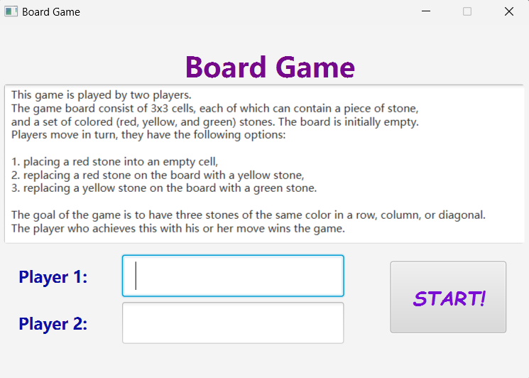
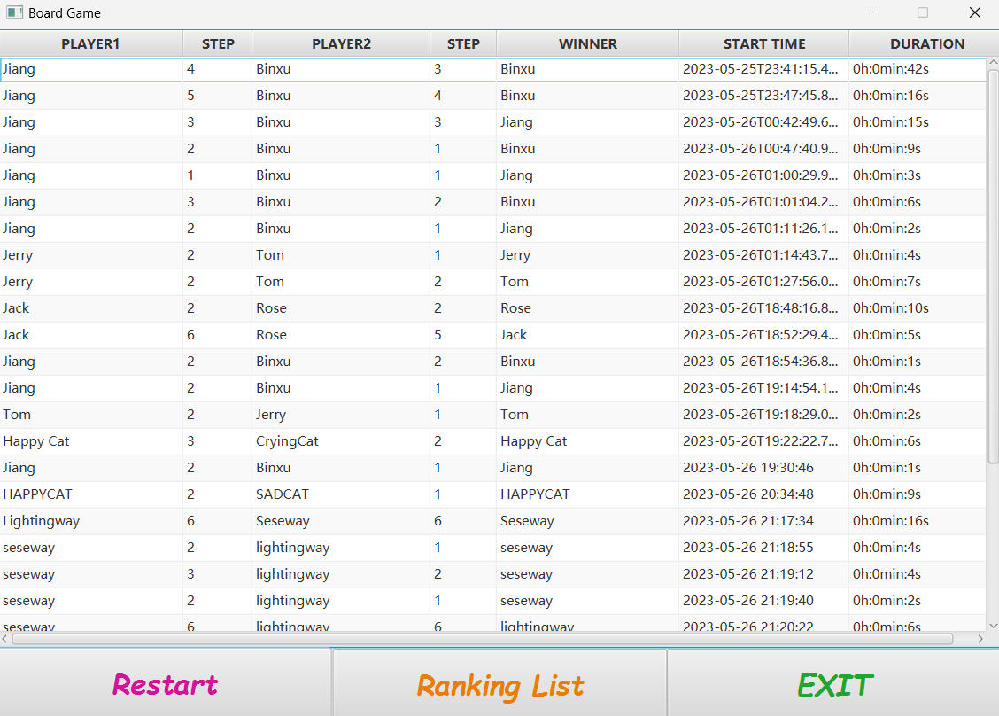
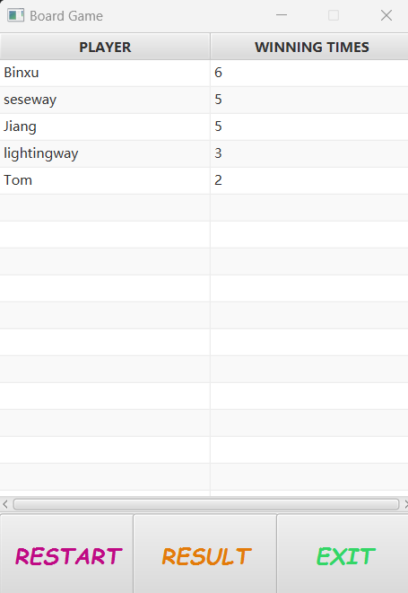

## Overview

**Board Game** is a JavaFX-based two-player turn-based board game. The game is played on a 3×3 board, where players take turns placing or upgrading coloured stones. The goal is to create three stones of the same colour in a row, column, or diagonal. This was one of my early game programming projects. It focused on building a complete playable desktop game with rule-based interaction, a graphical interface, player input, result recording, and a high-score table.

## Gameplay

Each cell on the board can be empty or contain a red, yellow, or green stone. When a player selects a cell, the cell changes through the sequence: **Empty → Red → Yellow → Green**.

A green stone is the final state of a cell and cannot be upgraded further. Players take turns interacting with the board until one player forms a line of three stones with the same colour. The player who completes the winning line wins the game.

*Gameplay screen showing the 3×3 board, coloured stones, player turns, operation counts, and game timer.*

## Implementation

The project was implemented with Java and JavaFX using an MVC-style structure. The game model manages the board state, stone upgrades, player switching, operation counts, and win-condition checking.

The JavaFX interface works as the view layer, allowing players to enter their names, interact with the board, see whose turn it is, receive warning messages for invalid actions, and view the final result after the game ends. The controller connects the interface with the game model by handling player actions, updating the board display, and navigating between the game, result, and ranking screens.

*Start screen where players enter their names and read the basic game rules before starting a match.*

## Result Recording and Ranking

The game also includes a result recording system. After each completed game, the application stores the player names, number of operations, winner, start time, and game duration.

These results are saved in a JSON file using Jackson. The result screen displays previous matches in a table, while the ranking screen shows players ordered by their winning times.

*Result screen showing previous matches, player steps, winners, start times, and game durations.*

*Ranking screen showing players ordered by winning times.*

## Tools and Methods

**Tools:** Java, JavaFX, Maven, Jackson  
**Methods:** MVC architecture, object-oriented programming, GUI development, event-driven programming, game state management, JSON persistence  
**Focus Areas:** Turn-based game logic, board game implementation, desktop game development, rule-based interaction

## Project Link

<a href="https://github.com/Elpiphoros/Board_Game" target="_blank" rel="noopener noreferrer">
View the GitHub repository
</a>