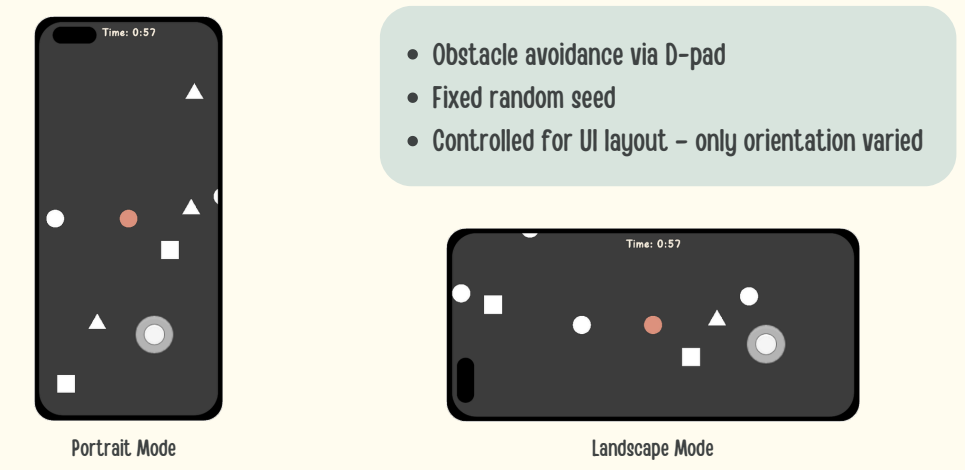
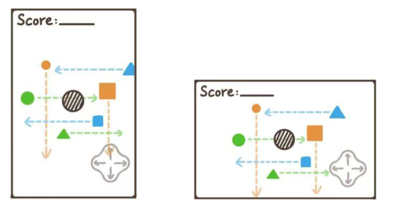

## Overview

FocusOrient is a human-computer interaction project that investigates how mobile screen orientation affects user attention, task performance, and perceived workload. The project uses a controlled mobile obstacle-avoidance game as a research prototype, comparing portrait and landscape modes under similar interaction and visual conditions.

The motivation behind this project came from a common mobile interaction question: many mobile games and task-focused applications can be experienced in different screen orientations, but the effect of orientation on attention and performance is not always clear. In attention-demanding mobile tasks, even small changes in screen layout, field of view, or control comfort may influence how users perceive and perform the task.

*Prototype comparison between portrait and landscape modes.*

## Prototype Design

To explore this question, we designed and developed a Unity-based mobile game prototype with two versions: portrait mode and landscape mode. Players controlled a character using a fixed D-pad and avoided obstacles approaching from different directions.

The game was designed as a controlled research tool rather than a commercial game. The main mechanics, visual layout, and difficulty were kept as consistent as possible across both orientations, so that screen orientation could be treated as the main experimental variable.

*Concept design of the portrait and landscape obstacle-avoidance game.*

## User Study

A user study was conducted with 16 participants. Each participant played both screen-orientation conditions, while objective gameplay data and subjective questionnaire responses were collected.

The evaluation included collision counts, gameplay performance, NASA-TLX workload ratings, and custom Likert-scale questions about perceived attention, comfort, and satisfaction.

## Findings

The results suggested that landscape orientation may support better performance and a slightly lower perceived workload in this type of attention-demanding mobile task. Most participants had fewer collisions in landscape mode, and the overall NASA-TLX score was slightly lower compared with portrait mode.

These findings provided useful design insights for mobile games and other attention-sensitive mobile interfaces, especially when screen orientation may influence visual attention, control comfort, and user experience.

## My Contributions

This was a group project, and I contributed across multiple stages of the project, including prototype development, experiment organization, data collection, reporting, and presentation.

- Contributed to the Unity development of the mobile game research prototype.
- Helped implement and refine the interaction logic for the obstacle-avoidance task.
- Contributed to the experimental design, including the comparison between portrait and landscape screen orientations.
- Helped organize the user study procedure and conduct the experiment with participants.
- Collected and organized gameplay and questionnaire data from the user tests.
- Contributed to data analysis and interpretation of the results.
- Contributed to writing the final research report.
- Designed and prepared presentation slides.
- Participated in the final in-person presentation and explanation of the project.

## Tools and Methods

Unity, C#, Mobile Game Prototype, Human-Computer Interaction, Mobile Interaction, User Study, NASA-TLX, Likert-scale Questionnaire, Data Collection, Data Analysis, Research Presentation

## Project Materials

[View the final report](Screen_Orientations_and_Attention__A_Gamified_Study_on_Mobile_User_Focus.pdf)