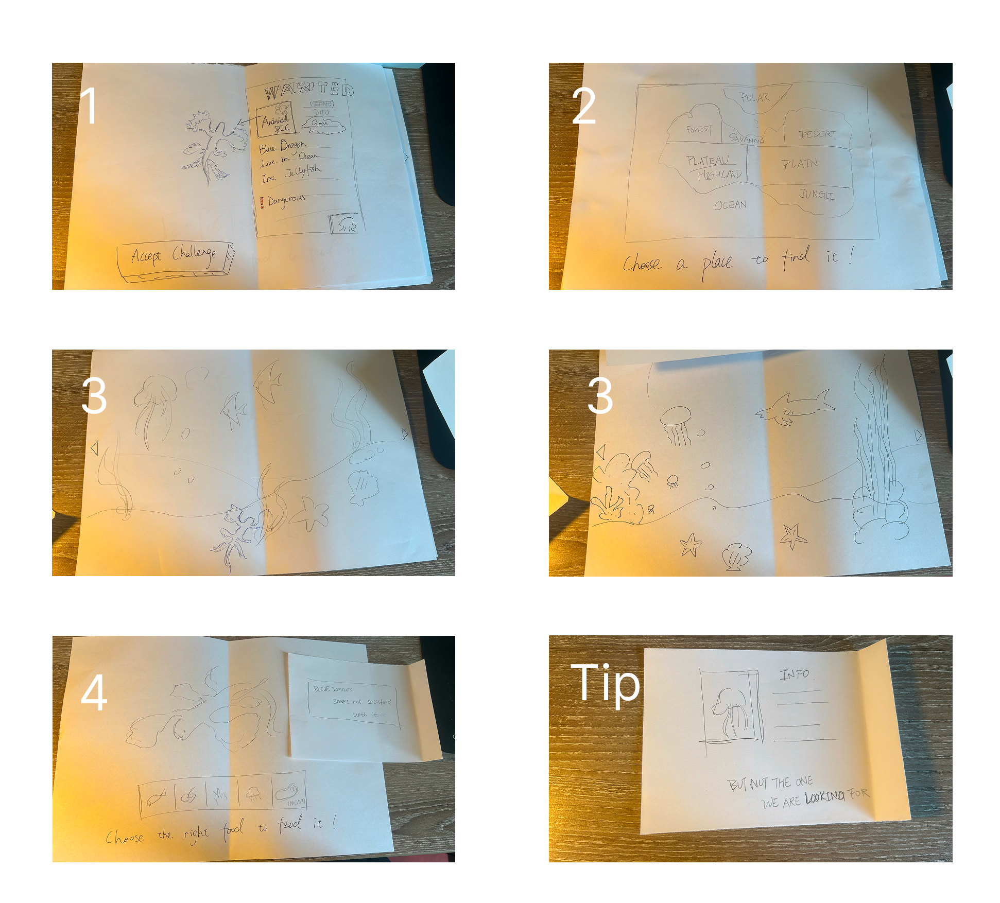

## Overview

**The World Zoo** is a 2D educational serious game prototype designed to help players learn about animals through exploration and interaction.  The game turns learning into a small discovery loop: players receive information about an animal, choose the correct habitat, search for the animal in the environment, feed it with suitable food, and add it to their catalog. The project focused on how animal knowledge could be embedded into gameplay actions. To find and feed an animal successfully, players need to remember what the animal looks like, where it lives, what it eats, and whether it may be dangerous. In this way, the game connects factual learning with player goals, feedback, and progression. The prototype was developed as part of a serious game design process, including learning goal definition, prior work review, paper prototyping, digital implementation, playtesting, and evaluation planning.

## Design Goal

The main design goal was to create an accessible educational game that helps players learn unfamiliar animals in a playful way. The game was originally designed with younger players in mind, but the concept was later framed more broadly as a lightweight animal discovery game for players who may not know much about unusual species.

The learning goals focused on helping players:

* recognize unfamiliar animals,
* understand which habitats they live in,
* identify what they eat,
* remember basic characteristics through repeated interaction.

At the same time, the game needed to provide a positive player experience. The intended experience was simple, exploratory, and friendly. Players should feel like they are going on a small animal-finding adventure rather than completing a school-style test.

## Design Process

The World Zoo was developed through an iterative serious game design process. Instead of starting directly from implementation, we first defined the learning goal, target audience, and intended player experience. We then reviewed existing educational games, animal-themed games, and serious games to understand how similar projects approached memory-based learning, player-friendly interaction, and animal knowledge.

Based on this early analysis, we created paper prototypes to test the core interaction flow before moving into digital implementation. These prototypes helped us examine whether players understood the main loop of the game: reading animal information, choosing a biome, searching for the animal, selecting the correct food, and collecting the animal in a catalog.

The prototype was then tested through playtesting sessions. During these tests, we observed how players interacted with the paper and digital prototypes, collected feedback, and identified usability and design issues. This feedback informed later design decisions, such as making the challenge button more visible, allowing players to revisit animal information, improving guidance on the first screen, and making the feeding interaction more meaningful.

## Prototype Design

The prototype used a 2D visual style and mouse-based interaction. Since the game was intended to be playable by younger or less experienced players, the interface needed to be simple, readable, and visually inviting.

The prototype included several key screens and interaction states:

* an animal information or wanted poster screen,
* a fantasy world map with different biomes,
* biome exploration scenes,
* animal selection and discovery interactions,
* food selection and feeding feedback,
* a catalogue or collection concept.

The design used clear visual feedback to help players understand whether they had made the correct or incorrect choice.

*Paper prototype documenting the core interaction flow from receiving animal information to choosing a biome, searching for the animal, selecting food, and receiving feedback.*

## Difficulty and Learning Progression

The game concept included three difficulty levels for each animal: easy, medium, and hard.

In **easy mode**, players could access information about the animal during gameplay. This supported early learning and reduced frustration.

In **medium mode**, information was mainly provided at the beginning. Players then had to rely more on memory while searching and feeding the animal.

In **hard mode**, the game acted more like a knowledge check. Players received little or no additional information and had to identify the correct biome, animal, and food based on what they had previously learned.

This difficulty structure was designed as a form of learning progression. Players first receive support, then gradually rely more on memory. The goal was to avoid overwhelming players while still encouraging them to remember and apply animal knowledge.

## Core Gameplay Loop

The central gameplay loop of The World Zoo consists of five phases:

1. **Receive animal information**
   The player first sees a wanted poster or information screen about a target animal. This introduces the animal's appearance, habitat, diet, and other important characteristics.

2. **Choose the correct biome**
   The player selects which biome to search, such as ocean, desert, jungle, forest, savanna, or polar region. This step connects the animal to its living environment.

3. **Search within the environment**
   After entering the chosen biome, the player explores the scene to find the animal. The goal is to make the learning task feel like a small search challenge rather than a direct multiple-choice question.

4. **Feed the animal**
   Once the animal is found, the player selects the correct food. This reinforces knowledge about whether the animal eats leaves, meat, insects, fish, jellyfish, or other food types.

5. **Add the animal to the catalogue**
   After successfully finding and feeding the animal, the player adds it to a catalogue. This creates a sense of collection and gives players a way to revisit what they have learned.

This loop was designed to make learning active. Players do not only read information; they use that information to make decisions in the game world.

## Prototype Demo

<video controls muted playsinline preload="metadata" width="100%">
  <source src="/videos/the-world-zoo-demo.mp4" type="video/mp4">
  Your browser does not support the video tag.
</video>

*Demo video.*

## Playtesting and Iteration

The prototype was tested through early playtesting with fellow students. The goal was to understand whether the core concept worked, whether players understood what to do, and whether the game felt engaging as a learning experience.

Several useful insights came from the playtests:

* Players wanted to be able to revisit animal information after starting the challenge.
* Some players did not immediately notice the Accept Challenge button, suggesting that important actions needed stronger visual emphasis.
* Players found the arrows and biome navigation mostly intuitive.
* Some players liked the immediate feedback after making right or wrong choices.
* Several players wanted more interaction, such as collecting food before feeding animals.
* Some players suggested that the learning part could feel more natural through dialogue or environmental interaction rather than only opening an information window.
* Players also suggested adding more animals, more difficulty variation, and more interactive elements in the environment.

These observations helped identify the difference between a functional educational prototype and a more engaging game experience. The prototype communicated the learning concept, but further iteration would be needed to make the game feel more playful and less like a sequence of information screens.

## Evaluation Plan

The evaluation plan focused on two main objectives:

1. To find out whether players learned new animal knowledge while playing the game.
2. To find out whether players had a positive player experience.

The planned learning evaluation used the hard difficulty level as a form of knowledge check. After learning about an animal in earlier levels, players would attempt the hard level without the same level of support. Their performance would indicate whether they could remember and apply the animal information.

The planned player experience evaluation used questionnaire responses and open-ended feedback. Questions focused on whether players had fun, whether they felt they learned new animals, whether they would recommend the game, and what could make the game more enjoyable.

Because the prototype was limited in scope, the evaluation was mainly useful for early design feedback rather than final proof of learning effectiveness. Its main value was to guide iteration and identify which parts of the concept were understandable, engaging, or confusing.

## My Contributions

This was a group project, and I contributed to the serious game design and prototype development process as part of the team.

* Contributed to the development of the educational game concept and core gameplay loop.
* Participated in defining the learning goal and player experience goal.
* Helped analyze existing educational and animal-themed games for design inspiration.
* Contributed to paper prototyping and early interaction flow design.
* Participated in the development of the digital prototype.
* Supported playtesting, observation, and feedback collection.
* Helped interpret playtest feedback and identify possible design improvements.

## Tools and Methods

* **Tools:** Unity, paper prototyping
* **Design Methods:** Serious game design, user-centered design, core loop design, iterative prototyping
* **Research Methods:** Prior work review, playtesting, observation, questionnaire design, qualitative feedback analysis
* **Focus Areas:** Educational games, animal knowledge, player experience, learning through interaction