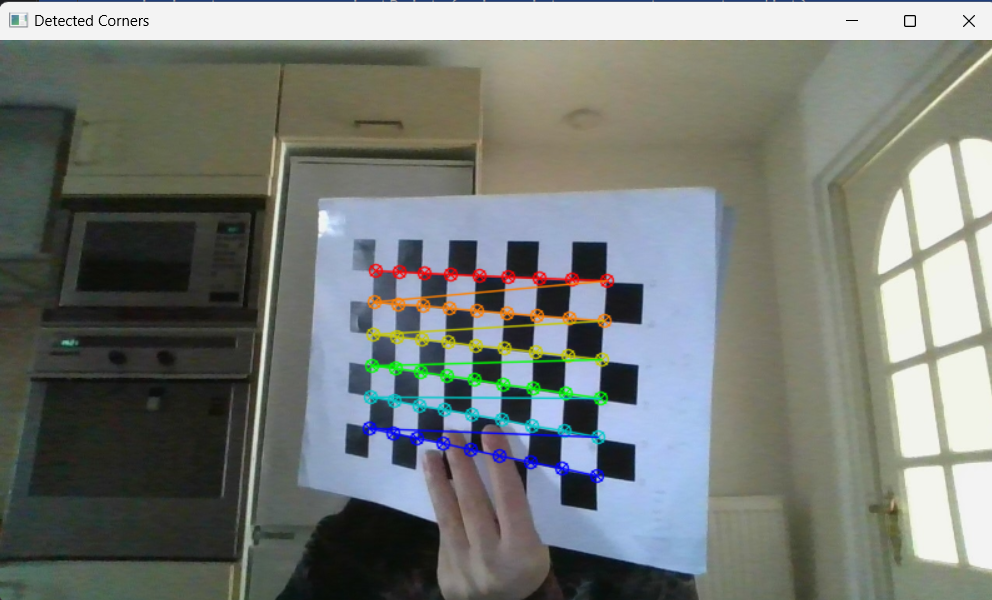
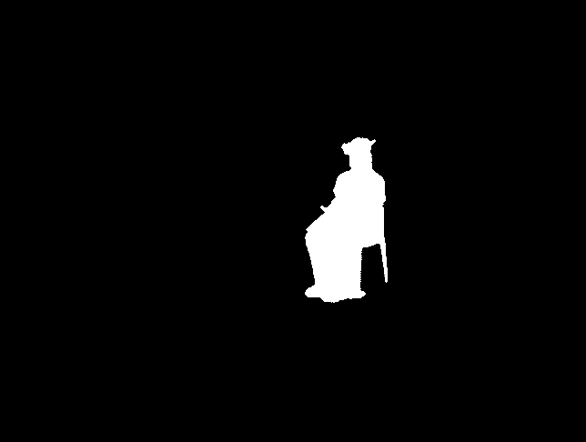
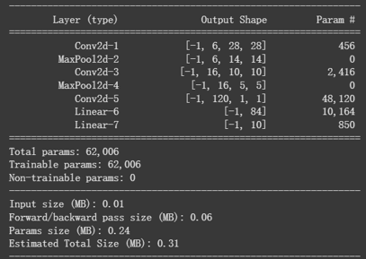
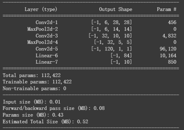
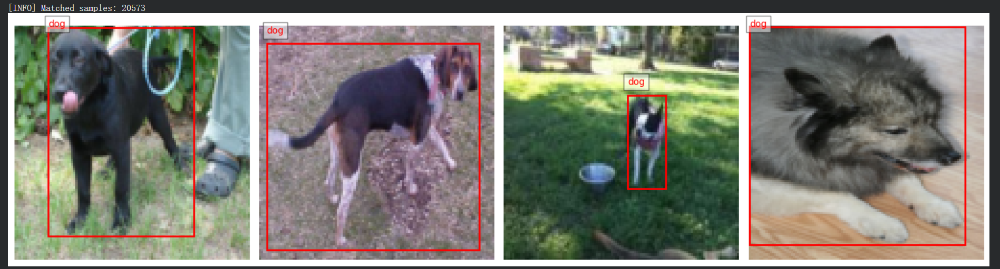

## Overview

**Computer Vision Coursework** is a collection of four assignments completed for the Computer Vision course. The assignments covered both geometric computer vision and recognition-based tasks, moving from camera calibration and 3D reconstruction to image classification and object detection. This page summarizes them as one technical coursework project. Together, they show my experience with camera geometry, image processing, 3D reconstruction, convolutional neural networks, and detection-oriented data processing.

The coursework can be divided into two parts: the first two assignments focused on geometric vision, while the last two assignments focused on learning and recognition.

## Assignment 1: Camera Calibration and Augmented 3D Projection

The first assignment focused on camera calibration and 3D projection using OpenCV. The goal was to estimate camera parameters from chessboard images and then use the calibrated camera to project virtual 3D geometry onto real images and webcam input.

I implemented a calibration workflow that detects chessboard corners, refines corner positions, collects 2D–3D point correspondences, and computes the camera matrix and distortion coefficients. When automatic corner detection failed, the program switched to a manual mode where the user selected four board corners. These manually selected corners were then used to estimate the full grid through a perspective transform.

*Detected chessboard corners used for camera calibration and 2D–3D correspondence estimation.*

After calibration, I used the estimated camera parameters with `solvePnP` and `projectPoints` to overlay a virtual cube and coordinate axes onto the chessboard. 

*Projected 3D cube and coordinate axes overlaid on the physical chessboard after camera calibration. This result demonstrates the use of calibrated camera parameters, pose estimation, and 3D-to-2D projection.*

I also implemented a real-time version using webcam input, where each frame was processed to detect the board, estimate camera pose, and render the projected cube and axes.

*Projected 3D cube and coordinate axes rendered on top of the physical chessboard using the calibrated camera.*

The assignment also included quality improvement steps. Reprojection error was used to identify low-quality calibration images, and images with high error were removed before recalibrating the camera. This helped improve the reliability of the final camera parameters.

**Key techniques:** OpenCV, camera calibration, chessboard corner detection, sub-pixel refinement, perspective transform, reprojection error, `solvePnP`, 3D-to-2D projection, real-time webcam processing.

## Assignment 2: Background Subtraction and 3D Voxel Reconstruction

The second assignment focused on 3D voxel reconstruction from multi-camera video input. The goal was to segment the foreground object from several camera views and reconstruct a 3D voxel representation by checking which voxels were visible across all cameras.

I first implemented a background subtraction pipeline. For each camera, an average background model was trained from the background video. Each video frame was converted into HSV colour space and compared against the background model using separate thresholds for hue, saturation, and value. The resulting foreground masks were further cleaned using morphological opening and closing operations, and contour filtering was used to keep the most relevant foreground region.

*Foreground mask generated through HSV-based background subtraction, morphological filtering, and contour-based foreground cleanup.*

After foreground extraction, I generated a 3D voxel volume and projected each voxel into the image planes of four calibrated cameras using the provided camera parameters. A voxel was kept only if its projection fell inside the foreground mask in all camera views. This produced a visual-hull-style reconstruction of the object from multiple silhouettes.

The reconstructed voxels were then visualized in an interactive OpenGL/GLFW environment. The viewer also displayed the camera positions and a ground grid, allowing the reconstructed volume to be inspected from different viewpoints.

*Interactive visualization of the reconstructed voxel volume from multiple camera silhouettes.*

**Key techniques:** background modelling, HSV foreground segmentation, morphological filtering, contour detection, multi-camera projection, voxel filtering, visual hull reconstruction, OpenCV, OpenGL, GLFW.

## Assignment 3: CNN-Based Image Classification

The third assignment explored image classification using convolutional neural networks on the CIFAR-10 dataset. This part moved from geometric computer vision to recognition-based learning.

The baseline model was based on the classic LeNet-5 architecture and was adapted for CIFAR-10, where each input image is a 32×32 RGB image and the output corresponds to one of ten categories. The model used convolutional layers, max-pooling layers, and fully connected layers to extract visual features and perform image classification.

*Baseline LeNet-style CNN model for CIFAR-10 classification. The model contains three convolutional layers, two max-pooling layers, and two fully connected layers, with 62,006 trainable parameters.*

Two architectural variants were then tested. One variant increased the number of kernels in the second convolutional layer to improve feature extraction capacity.

*First CNN variant for CIFAR-10 classification. This model increases the number of kernels in the second convolutional layer from 16 to 32, raising the total number of trainable parameters to 112,422 and increasing the model's feature extraction capacity.*

Another variant added a dropout layer with a probability of 0.2 to reduce overfitting and improve generalization.

*Second CNN variant for CIFAR-10 classification. This model keeps the expanded convolutional structure and adds a dropout layer after the fully connected layer to reduce overfitting and improve generalization.*

**Key techniques:** CIFAR-10 classification, convolutional neural networks, LeNet-5-style architecture, convolutional layers, max pooling, dropout, model comparison.

## Assignment 4: Object Detection with YOLO-Style Target Encoding

The fourth assignment focused on object detection. Object detection requires both category prediction and object localization.

This part implements the data pipeline for a cat-dog detection task. I created a custom PyTorch `Dataset` to load images, parse XML annotation files, match each image with its bounding-box labels, and map object categories into two classes: cat and dog. The dataset loader also resized input images and scaled bounding boxes accordingly.

*Sample images from the cat-dog detection dataset with parsed bounding boxes and class labels.*

The assignment also implemented YOLO-style target encoding. Each image was divided into a 7×7 grid, and each grid cell stored object location, confidence, and class information. For each object, the code computed the normalized bounding-box center, width, and height, assigned the object to the corresponding grid cell, and encoded the class label as a one-hot vector.

**Key techniques:** object detection, PyTorch Dataset, DataLoader, XML annotation parsing, bounding-box processing, image resizing, YOLO-style grid encoding, cat-dog detection dataset.

## Tools and Methods

**Tools:** Python, OpenCV, NumPy, PyTorch, OpenGL, GLFW  
**Datasets:** CIFAR-10, cat-dog object detection dataset, multi-camera video dataset  
**Models and Representations:** LeNet-5-style CNN, CNN model variants, visual hull, voxel grid, YOLO-style grid target encoding  
**Methods:** Camera calibration, chessboard corner detection, perspective transform, reprojection error filtering, `solvePnP`, 3D-to-2D projection, HSV background subtraction, morphological filtering, voxel reconstruction, CNN classification, bounding-box annotation parsing, object detection label encoding  
**Focus Areas:** Geometric computer vision, 3D reconstruction, image recognition, object detection, computer vision pipelines