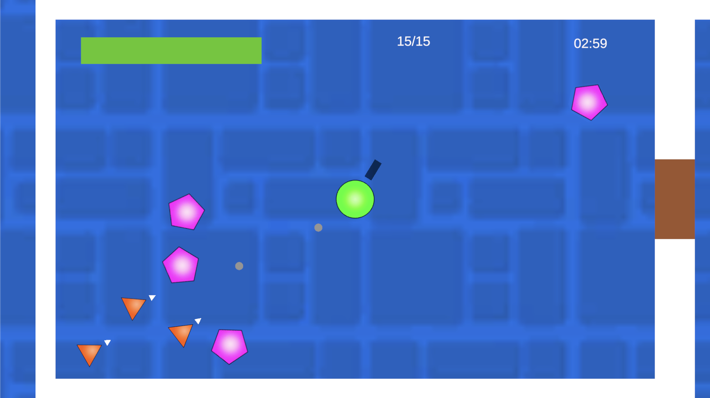
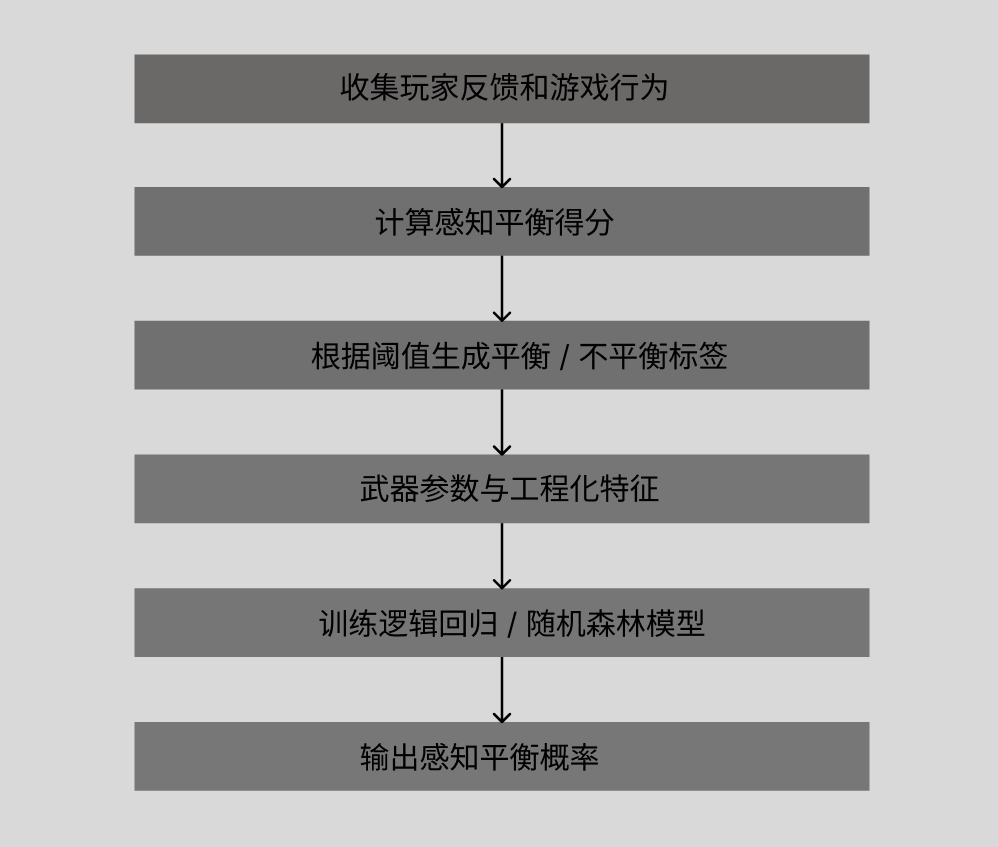
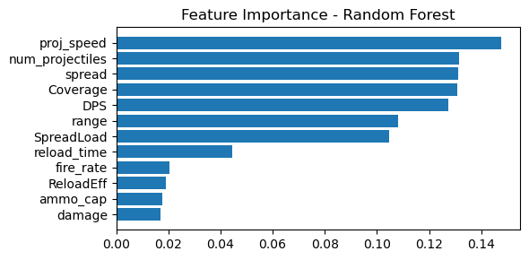

## 项目概述

这个项目探索了机器学习如何辅助游戏设计中的武器平衡评估。我们开发了一个名为 **TopDownShooter** 的 2D 俯视角射击游戏原型，玩家可以在游戏过程中切换四种武器：步枪、狙击枪、霰弹枪和冲锋枪。每种武器都有不同的设计参数，包括伤害、射速、射程、子弹速度、扩散范围、弹药容量、装填时间和暴击率等。

这个项目没有创造一个通用或客观的“武器平衡”定义，而是把武器平衡视为一种**玩家感知体验**。我们首先使用问卷反馈和游戏行为数据构造了一个 **感知平衡得分（PBS）**，然后训练机器学习模型，根据武器的数值参数预测某个武器配置是否会被玩家感知为平衡。

因此，这个项目是一个**数据辅助游戏平衡**的概念验证：即通过玩家反馈、游戏指标和机器学习，辅助设计者在武器调参过程中做出更有数据支持的判断。

## 项目动机

武器平衡是玩家体验中的重要部分。如果某一种武器过于强大，玩家可能会忽略其他选择，并依赖单一的最优策略。如果某种武器太弱、太慢或使用起来令人沮丧，玩家也可能完全避免使用它。良好的武器平衡应该支持公平性、挑战性、满足感和有意义的决策。

然而，武器平衡很难只通过数值参数来判断。高伤害的武器如果射速较慢、弹药有限或装填时间较长，仍然可能被玩家认为是平衡的。拥有多个弹丸的武器可能很有打击感，但如果扩散范围、射程或子弹速度没有调整好，也可能让玩家觉得混乱或不公平。

这个项目通过结合**主观玩家反馈**和**客观武器参数**来处理这一问题。机器学习在这里被用作一种辅助工具，用来建模武器数值和玩家感知平衡之间的关系。

## 游戏原型

TopDownShooter 是一个 2D 玩家对环境的俯视角射击游戏。玩家需要在房间中移动、击败敌人，并在限定时间内尽可能生存和完成挑战。在游戏过程中，玩家可以切换四种武器：

* 步枪
* 狙击枪
* 霰弹枪
* 冲锋枪

每种武器都围绕不同的玩法风格设计。步枪作为较为通用的基准武器；狙击枪强调高伤害和更谨慎的射击；霰弹枪强调多弹丸和扩散效果；冲锋枪则强调高射速和较大的弹药容量，但单发伤害较低。

这个原型被用作一个受控测试环境，用来收集玩家对不同武器的游戏行为数据和感知平衡反馈。

*TopDownShooter 游戏原型，用于收集游戏行为数据和玩家对武器平衡的反馈。*

## 数据收集与标签构造

我们组织了一次小规模玩家测试，共有 13 名参与者。每位参与者完成一次游戏测试，并在这次测试中使用和切换四种武器：步枪、狙击枪、霰弹枪和冲锋枪。游戏结束后，参与者通过针对每种武器的问卷题目评价自己的体验。

因此，数据是 **13 名参与者 × 4 种武器** 的 52 条武器层级评价。问卷内容涵盖了多个玩家体验维度，包括感知挑战、公平性、享受感、有效性、成就感，以及对具体武器属性的满意度，例如子弹速度、伤害、射程、弹药容量和装填时间。

为了将这些反馈用于监督学习，我们构造了一个加权的 **感知平衡得分（PBS）**。这个分数综合了：

* 平衡性和公平性评分；
* 享受感和成就感评分；
* 对具体武器属性的满意度；
* 游戏行为数据，例如武器使用时间和击杀数量。

感知平衡得分较高的武器评价被标记为**平衡**，较低的则被标记为**不平衡**。处于中间模糊区间的样本被移除，以让分类任务更加清晰。经过预处理后，最终保留了 41 条有效的武器层级记录用于建模。

## 特征工程

机器学习模型的输入特征来自武器参数，以及由这些参数计算出的衍生指标。

基础武器参数包括：

* 子弹速度
* 射速
* 伤害
* 射程
* 弹丸数量
* 扩散范围
* 弹药容量
* 装填时间
* 暴击率

在此基础上，我们进一步构造了几个更能描述武器行为的衍生特征：

* **每秒伤害（DPS）**：结合伤害和射速，用于描述单位时间内的输出能力。
* **装填效率**：结合弹药容量和装填时间，用于描述武器重新进入战斗状态的效率。
* **覆盖范围**：结合子弹速度和射程，用于描述武器的有效作用范围。
* **扩散负载**：结合扩散范围和弹丸数量，用于描述武器扩散带来的命中和控制特征。

这些衍生指标比单独的原始参数更能表达武器行为。例如，伤害本身并不能完整说明武器强度，因为武器的实际有效性还取决于它的射速、装填频率和攻击覆盖范围。

## 机器学习方法

这个预测任务被定义为一个监督式二分类问题。模型的输入是武器参数和经过特征工程得到的数值特征，输出是该武器评价是否被标记为玩家感知上的平衡或不平衡。

机器学习流程包括：

* 数据清理；
* 问卷评分归一化；
* 感知平衡得分构造；
* 移除中间模糊区间样本；
* 特征工程；
* 使用 `StandardScaler` 进行特征标准化；
* 模型训练与评估。

我们训练并比较了两个模型：

* **逻辑回归**：作为简单且可解释的基线模型。
* **随机森林**：用于捕捉武器参数之间可能存在的非线性关系。

模型评估使用了**分层三折交叉验证**。评估指标包括准确率、ROC-AUC、F1-score 和混淆矩阵。

*机器学习流程：玩家反馈和游戏行为被转换为感知平衡标签，随后模型根据武器参数和特征工程结果预测该标签。*

## 结果

在当前数据集和感知平衡得分定义下，逻辑回归和随机森林都取得了较强且相近的表现。模型能够以大约 90% 的平均准确率预测某条武器评价是否会被标记为玩家感知上的平衡。

较高的 ROC-AUC 分数表明，在这个数据集中，武器参数和感知平衡标签之间存在较稳定的关系。不过，由于数据集规模较小，这些结果应被理解为探索性结果，而不是可以直接泛化到所有游戏和武器系统的结论。

随机森林的特征重要性分析显示，**子弹速度**、**弹丸数量**和**扩散范围**是较重要的影响特征。这与直觉上的游戏设计经验一致：这些参数会直接影响武器在即时操作中的响应性、强度和混乱程度。

训练后的模型可以被用于测试新的武器配置。对于每个新的武器参数组合，模型会输出一个平衡概率分数，用来表示该武器在当前模型下被分类为玩家感知平衡的可能性。

*随机森林的特征重要性结果显示，子弹速度、弹丸数量和扩散范围是预测玩家感知武器平衡的重要特征。*

## 讨论

这个项目展示了机器学习如何作为一种设计辅助工具来支持游戏平衡。通过结合玩家反馈和可测量的武器参数，设计者可以在武器调参早期获得一些关于公平性、满足感和潜在过强风险的数据化参考。

一个重要发现是，玩家感知到的武器平衡并不只取决于原始伤害。与即时操作感相关的特征，例如子弹速度、弹丸数量和扩散范围，在模型预测中表现出较高的重要性。这说明玩家可能不仅通过长期数值效率来判断平衡，也会通过即时控制感、响应性和战斗节奏来形成判断。

同时，这个项目也有几个限制。首先，平衡标签依赖于我们根据问卷和游戏行为设计的加权感知平衡得分。因此，模型学习的是这个被操作化定义后的感知平衡标签，而不是一个客观或通用的武器平衡定义。

其次，数据集规模较小，只包含 13 名参与者和四种武器。模型也还没有用新的玩家、更多武器或不同敌人配置进行外部验证。因此，这个项目只是一个数据辅助武器平衡评估的概念验证，而不是一个已经完全通用化的武器平衡预测系统。

## 我的贡献

这是一个小组项目，我作为团队成员参与了开发和研究过程。

* 参与了 TopDownShooter 游戏原型的开发。
* 参与了玩家测试和数据收集过程。
* 参与整理游戏行为数据和问卷反馈。
* 参与机器学习建模流程，包括特征工程、输入标准化、逻辑回归和随机森林模型训练、交叉验证评估以及模型性能和特征重要性的解释。
* 参与了最终报告的撰写。

## 工具与方法

* **工具：** Unity, Python, Jupyter Notebook, Pandas, NumPy, Scikit-learn
* **机器学习：** 监督学习、逻辑回归、随机森林、StandardScaler、分层 K 折交叉验证
* **评估指标：** 准确率、ROC-AUC、F1-score、混淆矩阵、特征重要性
* **研究方法：** 用户研究、问卷、数据清理、特征工程、游戏平衡评估
* **关注方向：** 游戏 AI、武器平衡、玩家体验、数据驱动游戏设计

## 项目材料

<a href="/files/topdownshooter-weapon-balance-report.pdf" target="_blank" rel="noopener noreferrer">
查看最终报告
</a>
