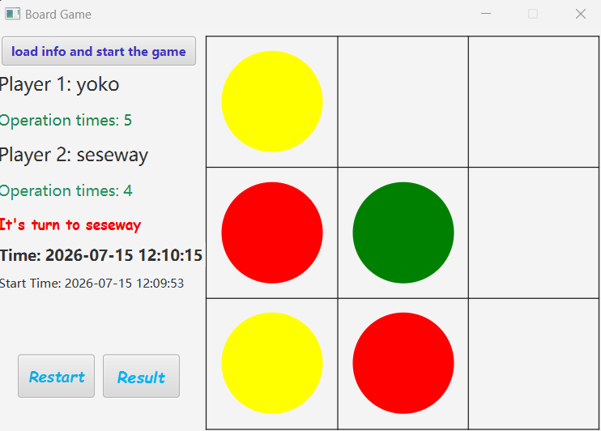

## 项目概述

**Board Game** 是一个基于 JavaFX 开发的双人回合制棋盘游戏。游戏在一个 3×3 棋盘上进行，两名玩家轮流放置或升级彩色棋子，目标是在一行、一列或一条对角线上形成三个相同颜色的棋子。这个项目是我早期的游戏编程项目之一，重点是构建一个完整可玩的桌面游戏，包括基于规则的交互、图形界面、玩家输入、结果记录和胜利次数排行榜。

## 游戏玩法

棋盘上的每个格子可以为空，也可以包含红色、黄色或绿色棋子。当玩家选择一个格子时，该格子的状态会按照以下顺序变化：**空 → 红色 → 黄色 → 绿色**。绿色棋子是一个格子的最终状态，不能继续升级。两名玩家轮流操作棋盘，直到其中一名玩家形成三个相同颜色棋子的横向、纵向或对角线连线。完成该连线的玩家获得胜利。

*游戏界面展示了 3×3 棋盘、彩色棋子、玩家回合、操作次数和游戏计时。*

## 实现方式

该项目使用 Java 和 JavaFX 实现，并采用了 MVC 结构。游戏模型负责管理棋盘状态、棋子升级、玩家切换、操作次数和胜利条件判断。JavaFX 界面作为视图层，允许玩家输入姓名、与棋盘进行交互、查看当前轮到哪位玩家、接收无效操作提示，并在游戏结束后查看最终结果。控制器则连接界面与游戏模型，负责处理玩家操作、更新棋盘显示，以及在游戏界面、结果界面和排行榜界面之间进行跳转。

*开始界面允许玩家输入姓名，并在比赛开始前阅读基本游戏规则。*

## 结果记录与排行榜

游戏还包含结果记录系统。每局游戏结束后，应用会保存玩家姓名、双方操作次数、胜者、开始时间和游戏时长。这些结果会通过 Jackson 保存到 JSON 文件中。结果界面以表格形式展示历史对局记录，排行榜界面则按照玩家胜利次数显示排名。

*结果界面展示了历史对局、玩家步数、胜者、开始时间和游戏时长。*

*排行榜界面按照玩家胜利次数进行排序。*

## 工具与方法

**工具：** Java、JavaFX、Maven、Jackson  
**方法：** MVC 架构、面向对象编程、GUI 开发、事件驱动编程、游戏状态管理、JSON 数据持久化  
**关注方向：** 回合制游戏逻辑、棋盘游戏实现、桌面游戏开发、基于规则的交互

## 项目链接

<a href="https://github.com/Elpiphoros/Board_Game" target="_blank" rel="noopener noreferrer">
查看 GitHub 仓库
</a>