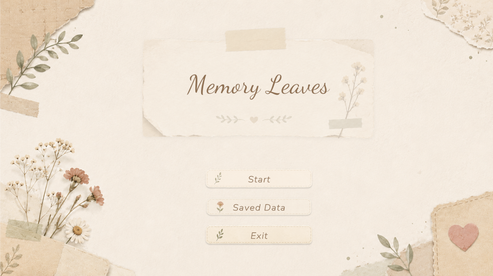

## 项目概述

**面向哀伤支持的拼贴式游戏化日记入口研究** 是我在乌特勒支大学的硕士论文项目。项目关注哀伤反思过程中用户可能难以开始表达的问题，探索文本书写与拼贴式游戏化两种日记入口，如何在不同反思任务下支持用户开始回忆、组织想法并表达个人感受。

我使用 Unity 与 C# 独立开发了跨平台研究原型，并设计了一项 2×2 组间用户实验。研究共邀请22名参与者完成引导式反思任务，收集 Likert 量表、SAM 情绪量表、开放式反馈以及文本与拼贴作品。目前项目处于数据分析与论文写作阶段，因此本页面主要介绍研究动机、原型设计和用户研究方法，完整研究结果将在论文完成后更新。

*主界面展示原型整体美术风格。*