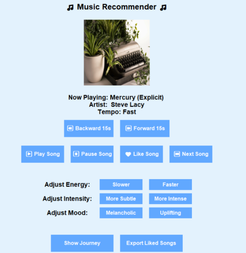

## 项目概述

**The Rhythms of Relief** 是一个交互式音乐推荐系统原型，旨在支持学生通过音乐缓解压力。该项目探索如何为习惯使用音乐调节压力的学生提供更加个性化的音乐推荐。项目关注学生在感到压力时会选择哪些类型的音乐。系统使用由学生提供的压力缓解歌曲作为数据来源，提取歌曲的音频特征，并通过 k-Means 聚类对歌曲进行分组，最后通过交互式原型向用户呈现推荐结果。该项目结合了音乐信息检索、机器学习、交互设计和用户研究方法。

## 研究重点

项目的主要研究问题是：能否开发一个混合音乐推荐系统，用于支持大学生基于情绪的压力应对。围绕这一问题，项目进一步关注了三个方面：

- 哪些音乐特征可能有助于学生缓解压力，
- 是否可以基于声学特征，使用 k-Means 聚类对学生选择的压力缓解歌曲进行分组，
- 交互式推荐原型在提供个性化压力应对歌曲方面的效果如何。

该项目的一个核心观点是，压力缓解音乐并不是一种固定的、适用于所有人的类型。有些学生可能更偏好平静、柔和、放松的歌曲，而另一些学生则可能通过更有能量或更具激励感的音乐来处理压力。

## 数据与音频特征分析

数据集由学生提供的压力缓解歌曲构成。它结合了一个已有的学生歌单，以及通过探索性问卷额外收集到的歌曲。音频特征使用 Python 和 Librosa 提取。分析重点关注以下特征：

- 节奏速度（tempo），
- 均方根能量（RMS energy），
- 频谱质心（spectral centroid），
- 频谱对比度（spectral contrast），
- 频谱平坦度（spectral flatness）。

在完成预处理和特征选择之后，项目使用 k-Means 聚类，根据歌曲的音频特征识别不同的歌曲组。聚类分析显示，学生用于压力缓解的音乐大体可以分为两种应对策略：平静放松型音乐，以及有能量或激励感的音乐。这一发现支持了压力缓解音乐推荐中个性化的重要性。一个只推荐慢速或放松音乐的系统，未必符合每个学生应对压力的偏好方式。

## 原型设计

该原型被设计为一个交互式音乐推荐系统。用户可以收听推荐歌曲、跳过歌曲、喜欢自己偏好的歌曲，并通过多个偏好控制按钮调整推荐方向。原型包含以下控制功能：

- 推荐更慢或更快的歌曲，
- 推荐更柔和或更强烈的音乐，
- 推荐更忧郁或更积极的情绪倾向，
- 喜欢并导出所选歌曲，
- 查看用户在不同聚类之间的聆听路径。

由于压力应对具有很强的个人差异和情境依赖性，因而该原型希望让用户在推荐过程中能够自主选择。

*原型界面展示了音乐播放、偏好调整控制、喜欢的歌曲，以及基于聚类的推荐导航。*

## 用户测试

该原型通过学生测试来评估其可用性、推荐相关性和整体设计概念。参与者与系统互动后，填写了一份关于使用体验的问卷。结果显示，参与者整体反馈较为积极。参与者对设计概念给出了较高评价，许多人表示该原型提供了适合压力缓解的音乐选择，并且推荐歌曲符合他们的偏好。测试也揭示了一些需要改进的地方，例如更清晰的界面引导、更灵活的偏好控制、更大的歌曲数据库，以及更可靠的音频特征提取。总体而言，用户测试表明该概念具有一定潜力，但如果要发展成完整可用的混合推荐系统，仍需要进一步开发和优化。

## 我的贡献

这是一个小组项目，我作为团队成员参与了研究、原型和评估过程。

- 参与设计面向学生压力缓解的音乐推荐系统概念。
- 参与研究过程，包括压力应对、音乐个性化和推荐系统方法相关讨论。
- 帮助整理和解释由学生提供的压力缓解歌曲数据。
- 参与音频特征分析和基于聚类的推荐方法设计。
- 参与原型设计和用户测试。
- 帮助分析用户在可用性、偏好匹配和推荐效果方面的反馈。
- 参与准备最终报告和展示材料。

## 工具与方法

**工具：** Python、Librosa、k-Means 聚类、交互式原型界面  
**方法：** 音频特征提取、聚类分析、探索性问卷、用户测试、问卷分析  
**关注方向：** 音乐推荐、学生压力缓解、个性化、HCI、用户体验  
**数据：** 学生提供的压力缓解歌曲和原型测试反馈

## 项目材料

<a href="/files/FinalReportProper.pdf" target="_blank" rel="noopener noreferrer">
查看完整报告
</a>