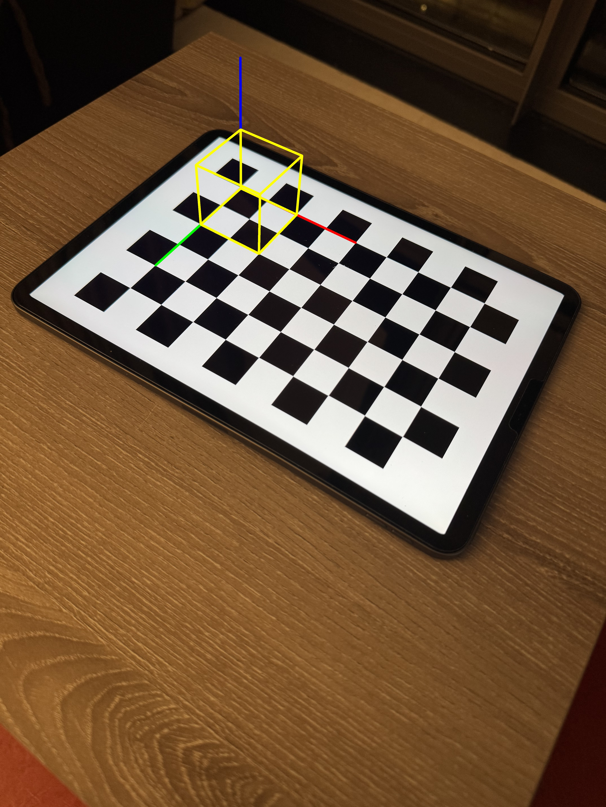
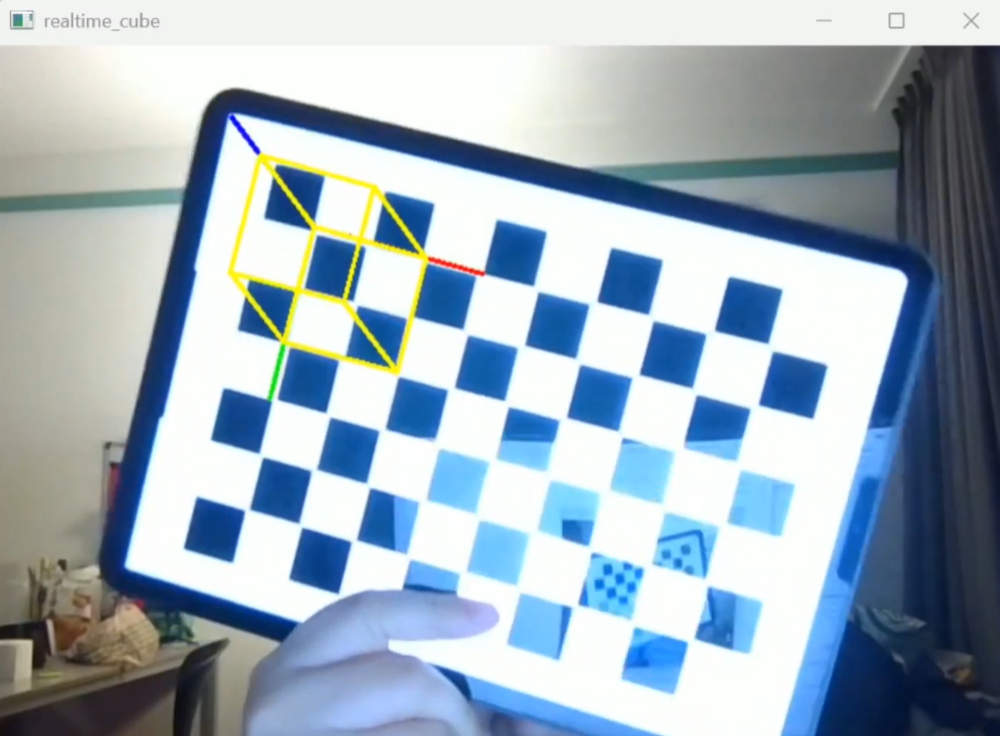
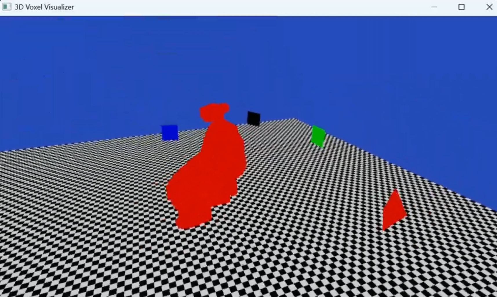
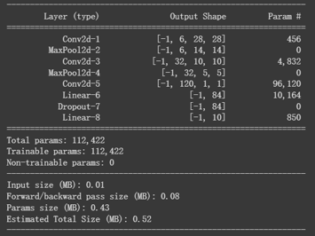

## 项目概述

**计算机视觉课程项目** 是我在计算机视觉课程中完成的一组作业项目。课程内容同时覆盖了几何视觉和基于学习的识别任务，从相机标定和 3D 重建，逐步延伸到图像分类和目标检测。这个页面将四个作业整理为一个综合性的技术项目，用于展示我在相机几何、图像处理、3D 重建、卷积神经网络，以及目标检测数据处理方面的实践经验。

整个课程项目可以分为两个部分：前两个作业主要关注几何视觉，后两个作业则主要关注学习与识别任务。

## 作业 1: 相机标定 与 增强 3D 投射

第一个作业主要关注使用 OpenCV 进行相机标定和 3D 投影。任务目标是从棋盘格图像中估计相机参数，并使用标定后的相机参数，将虚拟 3D 几何体投影到真实图像和实时摄像头画面中。

我实现了一个相机标定流程，包括检测棋盘格角点、细化角点位置、收集 2D–3D 点对应关系，并计算相机矩阵和畸变系数。当自动角点检测失败时，程序会切换到手动模式，由用户选择棋盘格的四个角点。随后，这四个手动选择的角点会通过透视变换估计出完整的棋盘格点阵。

*用于相机标定和 2D–3D 对应关系估计的棋盘格角点检测结果。*

完成相机标定后，我使用估计出的相机参数，并结合 `solvePnP` 和 `projectPoints`，将虚拟立方体和坐标轴叠加到棋盘格图像上。

*在完成相机标定后，将虚拟 3D 立方体和坐标轴叠加到真实棋盘格图像上的结果。该结果展示了相机参数、姿态估计和 3D-to-2D 投影的使用。*

我还实现了一个基于摄像头输入的实时版本。在该版本中，每一帧画面都会被处理，用于检测棋盘格、估计相机姿态，并实时渲染投影后的立方体和坐标轴。

*使用标定后的相机参数，在真实棋盘格上实时渲染虚拟 3D 立方体和坐标轴。*

该作业还包含了标定质量改进步骤。我使用重投影误差识别低质量标定图像，并在重新标定前移除误差较高的图像，从而提高最终相机参数的可靠性。

**关键技术：** OpenCV、相机标定、棋盘格角点检测、亚像素角点细化、透视变换、重投影误差、`solvePnP`、3D-to-2D 投影、实时摄像头处理。

## 作业 2: 背景减除 与 3D 体素重塑

第二个作业主要关注基于多相机视频输入的 3D 体素重建。任务目标是从多个相机视角中分割出前景对象，并通过检查体素在所有相机视角中的可见性，重建出对象的 3D 体素表示。

我首先实现了一个背景减除流程。对于每个相机，我使用背景视频训练平均背景模型。随后，每一帧视频都会被转换到 HSV 色彩空间，并分别基于色相、饱和度和亮度阈值与背景模型进行比较。生成的前景 mask 会进一步通过形态学开运算和闭运算进行清理，并使用轮廓过滤保留最主要的前景区域。

*通过基于 HSV 的背景减除、形态学滤波和轮廓筛选生成的前景 mask。*

完成前景提取后，我生成了一个 3D 体素空间，并使用给定的相机参数，将每个体素投影到四个标定相机的图像平面中。只有当一个体素在所有相机视角中的投影都落在前景 mask 内时，该体素才会被保留下来。这个过程形成了一个基于多视角轮廓的 visual-hull-style 重建结果。

重建后的体素随后在一个交互式 OpenGL/GLFW 环境中进行可视化。该查看器同时显示了相机位置和地面网格，使重建出的体积可以从不同视角进行观察。

*基于多相机前景轮廓重建出的 3D 体素结果的交互式可视化。*

**关键技术：** 背景建模、HSV 前景分割、形态学滤波、轮廓检测、多相机投影、体素筛选、visual hull reconstruction、OpenCV、OpenGL、GLFW。

## 作业 3: 基于 CNN 的图像分类

第三个作业探索了使用卷积神经网络在 CIFAR-10 数据集上进行图像分类。该部分从几何视觉转向了基于学习的视觉识别任务。

baseline 模型基于经典的 LeNet-5 架构，并针对 CIFAR-10 进行了适配。CIFAR-10 中每张输入图像都是 32×32 的 RGB 图像，模型输出对应十个类别之一。该模型使用卷积层、最大池化层和全连接层来提取视觉特征并完成图像分类。

*用于 CIFAR-10 图像分类的 baseline LeNet-style CNN 模型。该模型包含三个卷积层、两个最大池化层和两个全连接层，共有 62,006 个可训练参数。*

随后，我测试了两个模型结构变体。其中一个变体增加了第二个卷积层的卷积核数量，以提升模型的特征提取能力。

*用于 CIFAR-10 图像分类的第一个 CNN 变体。该模型将第二个卷积层的卷积核数量从 16 增加到 32，使可训练参数总数提升到 112,422，并增强了模型的特征提取能力。*

另一个变体加入了 dropout layer，dropout 概率为 0.2，用于减少过拟合并提升模型泛化能力。

*用于 CIFAR-10 图像分类的第二个 CNN 变体。该模型保留了扩展后的卷积结构，并在全连接层之后加入 dropout layer，以减少过拟合并提升泛化能力。*

**关键技术：** CIFAR-10 图像分类、卷积神经网络、LeNet-5-style 架构、卷积层、最大池化、dropout、模型结构对比。

## 作业 4: 目标检测

第四个作业主要关注目标检测。目标检测不仅需要预测图像中的物体类别，还需要定位物体在图像中的位置。

这一部分实现了一个面向猫狗检测任务的数据处理流程。我创建了一个自定义 PyTorch `Dataset`，用于加载图像、解析 XML 标注文件、将每张图像与对应的目标边界框标注进行匹配，并将物体类别映射为 cat 和 dog 两类。数据加载器还会将输入图像调整为固定尺寸，并同步缩放对应的边界框。

*猫狗目标检测数据集的样例图像，其中包含解析出的 目标边界框 和类别标签。*

该作业还实现了 YOLO 风格的目标标签编码。每张图像会被划分为 7×7 的网格，每个网格单元存储物体位置、置信度和类别信息。对于每个物体，代码会计算归一化后的目标边界框中心点、宽度和高度，将目标分配到对应的网格单元，并将类别标签编码为独热向量。

**关键技术：** 目标检测、PyTorch Dataset、DataLoader、XML 标注解析、目标边界框处理、图像 resize、YOLO 风格网格编码、猫狗检测数据集。

## 工具与方法

**工具：** Python、OpenCV、NumPy、PyTorch、OpenGL、GLFW  
**数据集：** CIFAR-10、猫狗目标检测数据集、多相机视频数据集  
**模型与表示方法：** LeNet-5-style CNN、CNN 模型变体、visual hull、体素网格、YOLO 风格的网格化目标标签编码  
**方法：** 相机标定、棋盘格角点检测、透视变换、重投影误差过滤、`solvePnP`、3D-to-2D 投影、HSV 背景减除、形态学滤波、体素重建、CNN 图像分类、目标边界框标注解析、目标检测标签编码  
**关注方向：** 几何计算机视觉、3D 重建、图像识别、目标检测、计算机视觉流程