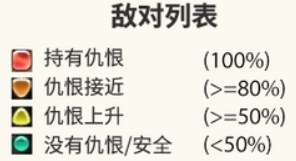

## 引言

在《最终幻想14》（下文简称FF14）中，仇恨机制一直是坦克职业玩家（下文简称坦克玩家）体验的重要组成部分。坦克玩家在游戏中需要承受来自敌人的伤害，保护非坦克玩家免受来自敌人的普通攻击（下文简称平A）和高伤害单体技能（下文简称死刑）。在旧仇恨机制中，坦克玩家需要通过开启坦克姿态（下文简称盾姿）、使用一系列提高仇恨的技能连击（以下简称仇恨连）、以及使用挑衅和退避等技能来维持仇恨，始终保持为被敌人攻击的第一目标或第二目标（下文简称一仇，二仇），避免输出或治疗职业因为输出或治疗量过高而使仇恨超越坦克职业玩家的问题（下文简称OT）[1]。因此，坦克玩家最基本却最重要的任务是要在战斗过程中持续控制敌人的攻击目标、位置和朝向，使团队能够在稳定环境下完成输出、治疗和机制处理等任务，避免团灭。然而，坦克玩家在高难副本中，除了完成坦克的基本职责以外，也有对更高输出的追求。尤其是在玩家会通过战斗记录间的输出排名比较表现的环境下，坦克的输出能力也成为玩家评价和自我优化的一部分。

但在旧版本仇恨机制中，稳定维持仇恨和输出表现之间存在矛盾。坦克玩家如果想要稳定维持仇恨，就不得不使用一些会降低输出效率的技能或状态。因而许多坦克玩家并不喜欢旧版本中“维持仇恨会导致输出下降”的设计[2]。于是在5.0版本中，制作组对仇恨机制进行了简化[3]。这次简化解决了因维持仇恨导致的伤害降低问题，同时也产生了其他影响。例如简化后的机制降低了坦克职业的入门门槛，让一些想尝试坦克、但担心给团队造成负担或被其他玩家批评的玩家，更容易开始尝试、体验这一职业。但是，这一改动也移除了旧仇恨机制围绕仇恨管理进行风险判断的策略乐趣，从而引发了玩家新的讨论和不满。

在本文余下部分，部分1将分析FF14旧版本的仇恨机制，包括玩家体验、机制构成、可能的设计原因以及后续制作组进行简化的原因。部分2将分析5.0版本简化后的新仇恨机制，并比较这一改动带来的影响。最后，部分3将对仇恨机制变化进行总结。

## 旧仇恨机制分析

需要说明的是，由于目前官方职业指南最早只能追溯到6.2版本，因而更早版本的技能改动记录并不完整[4]。同时，史克威尔伊尼克斯官方（下文简称SE）也没有公开过完整的仇恨计算公式，因此本文对旧版本仇恨机制的分析主要参考4.0版本时期的战士职业攻略及相关玩家社区资料[1][5]。以下内容的重点不在于复原每一个具体数值或完整计算公式，而是分析旧版本仇恨机制如何通过伤害、治疗量、能力技、仇恨连、特殊技能和盾姿影响坦克、输出和治疗职业的操作行为与战斗体验。

### 1.1 旧仇恨机制的构成

旧版本仇恨机制中，敌人会根据各玩家对其产生的仇恨值来判断主要攻击目标，即仇恨值最高的玩家会成为该敌人的第一攻击对象。根据国际服玩家社区的测试与统计资料，旧版本中多数战斗行为都会产生仇恨。仇恨值的计算可能是以伤害量或治疗量为基础，再乘以不同技能或状态所对应的仇恨倍率。因此，旧版本仇恨机制是由伤害、治疗量、能力技以及坦克职业的仇恨控制工具四部分共同影响。首先，伤害和治疗量是仇恨产生的基础来源。输出职业主要通过造成伤害产生仇恨，治疗职业主要通过治疗量产生仇恨，而坦克职业则需要通过仇恨连、能力技、带有仇恨效果的特殊技能以及盾姿，这些拥有超高仇恨倍率的手段，来放大自身仇恨，从而保证自己的仇恨始终高于输出和治疗职业。

其次，旧版本中还存在直接影响仇恨的能力技。对于输出和治疗职业，都有一个可以使自身仇恨减半的能力技[6][7]。对于坦克职业，能力技则更多用于主动控制仇恨顺序。例如，挑衅可以让坦克直接成为当前一仇，退避则可以将自身的一部分仇恨转移给目标队友，因此常用于需要换坦的特殊机制。

最后，坦克职业还拥有一系列专门用于提高仇恨生成的职业工具，例如仇恨连、带有仇恨效果的特殊技能，以及盾姿。这类工具用一部分伤害收益换取更高的仇恨倍率或仇恨增益效果，带来了更稳定的仇恨控制[1][5]。

* **仇恨连**。以旧版本战士为例，战士在战斗中并不是只使用一套固定连击技能，而是需要根据当前战斗阶段、资源情况和仇恨状态选择不同连击技能。大体上，战士的连击可以分为爆发期使用的连招和非爆发期使用的连招。在非爆发期，战士可选择的连击中，有一类是带有提高仇恨效果的仇恨连，其他连击则更偏向于伤害收益、生存收益或增益效果。仇恨连的总体输出收益通常低于其他类型连击。

* **带有仇恨效果的特殊技能**。旧版本战士拥有需要消耗职业资源的特殊攻击，而这些技能之间也存在“偏仇恨”和“偏伤害”的区别。有一种技能带有提高仇恨的效果，但伤害较低。另一种技能伤害更高，但不提供额外仇恨收益。由于这两种技能会消耗相同数量的职业资源，因此玩家在使用时就会产生取舍。

* **盾姿**。旧版本的盾姿是一个会影响仇恨收益和输出效率的状态选择。开启盾姿可以显著提高仇恨生成，让拉怪更加稳定。但同时，盾姿也会降低坦克的伤害输出。

通过以上构成不难发现，旧仇恨机制是一种每个职业都会参与其中，并以不同方式对仇恨管理作出贡献的团队压力系统。

### 1.2 旧仇恨机制下的玩家体验

在FF14的一场战斗中，坦克玩家的目标是要让自己始终保持在敌人的仇恨列表前列，通常需要稳定处于一仇或二仇的位置。这是为了保证敌人的平A以及死刑技能不会打到输出或治疗职业身上，同时也能保持敌人的位置和朝向稳定，为团队创造安全的输出和治疗环境。图1展示了敌对列表中敌人的仇恨状态。

*图 1：敌对列表中的仇恨状态提示。
 敌对列表会通过不同颜色显示玩家与敌人之间的仇恨关系。红色表示玩家已经持有仇恨，即当前是敌人的主要攻击目标；橙色表示仇恨接近，需要注意可能被敌人转火；黄色表示仇恨正在上升；绿色则表示当前仇恨较低或处于安全状态。*

为了完成这个目标，坦克玩家需要根据战斗情况选择不同类型的技能进行仇恨控制。以旧版本战士为例，玩家可以使用仇恨连，或者使用带有仇恨效果的特殊技能来快速建立和补充仇恨。同时，坦克玩家还需要决定是否开启盾姿。盾姿能够提高仇恨生成，使拉怪更加稳定。但提高仇恨的技能和盾姿会导致输出效率下降。因此，旧版本坦克并不是单纯地打出最高伤害，而是在“保证仇恨稳定”和“尽可能提高输出”之间不断做出取舍。当坦克职业玩家能够在始终保持一仇或者二仇的前提下，减少仇恨连、切换到更高收益的输出选择时，玩家就会在仇恨管理和输出效率之间产生明显的取舍与博弈感。而坦克职业本身就带有“站在队伍最前方，承受伤害、保护队友”的角色形象。当玩家既能保证完成自身职责，又能尽可能打出更高伤害时，就会获得一种“既保护了大家，又打出了高伤害”的掌控感和成就感。即这种机制对应了自我决定理论中的基本心理需求[8]：坦克职业玩家通过技能选择获得自主感，通过稳定维持仇恨并提高输出，并成功扮演“前线守护者”的角色形象获得胜任感，同时也通过保护队友、维持团队稳定获得关系感。

进一步来说，旧仇恨机制的乐趣并不是直接来自操作本身的繁琐，而是来自这些操作背后所承担的后果。减少仇恨连、切换到更高收益的输出选择，会让玩家在“更高输出”和“仇恨稳定”之间承担判断风险。如果判断正确，坦克既能维持队伍安全，又能提高个人输出；如果判断失误，则可能导致仇恨失控，影响敌人的攻击目标和队伍稳定，从而导致团灭。因此，坦克玩家在旧仇恨机制中的取舍博弈是一种对团队会产生实际后果的职责判断。

而对于输出和治疗职业来说，输出职业如果处在战斗开场，或者处在团队爆发期，就可能因频繁使用高伤害爆发技能而快速接近甚至超过坦克的仇恨。治疗职业在高压阶段提供大量治疗时，也可能因为治疗量产生较高仇恨。因此，在旧版本仇恨机制下，输出和治疗职业并不能完全不用关心仇恨，而是需要根据坦克玩家当前已经建立的仇恨情况，来调整自己的输出或治疗节奏，并使用各自降低仇恨的能力技，避免在关键阶段可能造成的OT情况。因而可见，旧版本仇恨机制本质是一种由坦克主导，输出和治疗共同协助，由团队合作管理仇恨的团队压力系统。也正是这种共同参与的结构，旧仇恨机制产生了更强的团队协作感。

### 1.3 旧仇恨机制的可能设计原因与影响

从设计效果来看，旧版本仇恨机制的作用之一，是让坦克职业拥有区别于输出和治疗职业的核心职责和定位，即在整场战斗中主动控制敌人的攻击目标、位置和朝向，从而保护队友并维持稳定的战斗环境。即在战斗过程中，通过“仇恨稳定性”和“输出效率”之间的持续冲突，让坦克玩家在不同的环境下做出职责判断。这种机制设计能够满足自我决定理论所强调的基本心理需求，从而激发坦克玩家的内在动机。此外，旧版本仇恨系统把坦克、输出和治疗职业更紧密地连接在一起，让不同职业之间的技能释放影响仇恨，从而共同维持战斗秩序，增强了队伍的配合感。

但旧版本仇恨机制也存在明显缺点。首先，它增加了坦克玩家需要监控的信息量。坦克不仅要关注副本机制，还要持续注意敌对列表和队友仇恨情况。如果战斗中同时存在换坦、小怪、Boss机制和队伍爆发期，坦克玩家需要处理的任务会明显增加。因此，它也提高了坦克职业的入门门槛，对坦克玩家提出了更严格的职责要求。此外，旧版本仇恨机制也会对输出和治疗职业造成负面体验。输出职业如果担心出现OT情况，且降低仇恨的能力技还在冷却时间，就可能需要延后爆发，影响输出节奏。治疗职业如果处在高压阶段且需要产生大量治疗量时，可能会因为仇恨过高，且能力技处在冷却时间而被敌人攻击至死。虽然这种设计增加了团队协作感，但也可能让非坦克职业觉得自己的操作选择受到了额外限制。

此外，虽然旧版本仇恨机制给坦克玩家提供了很强的职责感和博弈乐趣，但这种博弈也带来了新的矛盾。在正常情况下，坦克玩家可以根据战斗节奏主动规划仇恨连、盾姿和其他仇恨控制手段的使用，此时仇恨管理仍然是一种策略性操作。然而，当输出或治疗职业产生过高仇恨时，坦克玩家不得不通过额外的仇恨连或盾姿来进行补救。即玩家为了完成坦克职责，反而需要牺牲自己在输出数据上的表现。此时，原本具有策略性的仇恨与伤害博弈，会被部分玩家体验为一种对坦克职责的输出惩罚。

在高难副本环境中，这一矛盾会被进一步放大。对于高难PVE玩家来说，通关并不是唯一目标。FFLogs这一战斗数据网站会记录并展示玩家在同职业、同副本中的输出数据、百分位和排名[9]，因此许多玩家不仅希望完成副本，也希望打出更高的秒伤，并在同职业玩家的比较、竞争中取得更高排名。在这种社区氛围下，当队伍已经成功通关、坦克也完成了仇恨稳定、减伤和站位等基本职责时，通关结果本身已经不太能进一步区分不同坦克玩家的表现。相比之下，输出数据便成为更直观且可比较的高阶表现指标。于是，因仇恨管理或额外限制导致的输出下降，便容易被玩家视为一种负面体验。总之，当输出表现成为玩家自我优化和同职业竞争比较的重要标准时，旧版本中原本具有策略性的仇恨与伤害博弈则会让玩家感受到惩罚感。为了解决旧机制中坦克玩家遭遇的这个“因承担坦克职责而降低输出表现”的问题，制作组在5.0版本对旧仇恨机制进行了大规模调整简化[3]。

## 新仇恨机制分析

在这一部分中，本文主要参考了5.0版本时期的战士职业攻略及相关玩家社区资料，对5.0版本之后的新仇恨机制进行分析[10][11]。与旧版本仇恨机制相比，新版本仇恨机制的核心变化是将仇恨管理简化为以盾姿为核心的高仇恨生成机制。

### 2.1 新仇恨机制的体验与分析

5.0版本之后，FF14的仇恨机制被大幅简化。最核心的变化是盾姿删去了旧版中的输出惩罚，变成了高仇恨生成开关。只要坦克开启盾姿并正常释放技能进行输出，就可以产生大量仇恨，并稳定维持在一仇或二仇的位置。因此，旧版本中坦克职业专门用于提高仇恨的仇恨连和相关特殊技能因不再具有之前存在的必要性，而被删除或调整。同时，由于输出和治疗职业在正常情况下已经很难超过开盾姿坦克的仇恨，原本用于降低自身仇恨的能力技也因失去了主要作用而被调整。最终，输出和治疗职业不再需要频繁关注仇恨变化。他们只需要专注于自己的输出循环、治疗任务和副本机制处理。对于坦克玩家来说，新仇恨机制并没有改变核心职责，即坦克玩家仍需优先保证团队安全。而变化在于，新仇恨机制下的仇恨稳定更容易实现。因此，坦克也不再需要在仇恨稳定和输出效率之间反复取舍，而是在稳定掌控仇恨的前提下，为副本攻略贡献更高的伤害占比。

因而可见，新仇恨机制改变了仇恨系统在团队中的位置。由原本的坦克主导、输出和治疗共同参与仇恨管理的合作模式，转变为了在正常情况下，输出和治疗基本脱离仇恨管理，完全由坦克负责掌控的基础战斗规则。即在新仇恨机制下，坦克负责维持仇恨、贡献更高伤害；其他职业不再需要围绕仇恨变化调整节奏，而是各司其职，完成本职任务。

### 2.2 新仇恨机制的影响

仇恨机制的简化不仅解决了仇恨管理的输出惩罚问题，还在实际战斗体验中产生了额外的正面影响。随着FF14高难副本从早期较多依赖副本内交互解密，逐渐发展为更强调时间轴记忆、站位处理、减伤安排和团队配合的设计，玩家在战斗中本身就需要处理大量信息。在这种情况下，减少仇恨管理带来的额外监控压力，可以让战斗流程变得更加稳定。这也降低了不同职业之间因仇恨失控而产生的额外干扰，使玩家能够更专注于自己的职业循环、治疗安排和副本机制处理。

但简化后的新仇恨机制也带来了一些问题。比如旧版本中围绕仇恨管理产生的操作取舍被删除。而在新版本中，仇恨管理变成一种默认规则，玩家不再需要频繁通过技能选择来体现自己对仇恨的控制能力。因此，坦克玩家在“安全维持仇恨”和“追求输出效率”之间的博弈不再存在，导致旧仇恨机制围绕仇恨管理进行风险判断的策略乐趣也不再存在。玩家社区中也存在类似讨论，例如有玩家希望重新退回到旧仇恨机制，或认为当前坦克玩法在仇恨层面过于简单[12][13][14]。这也体现了玩家前后需求存在一定矛盾：他们既希望坦克玩法保留一定的博弈深度，又希望这种博弈不要影响自身的输出表现。这种需求矛盾也解释了为什么5.0后的新仇恨机制虽然解决了旧仇恨机制中的输出惩罚问题，却又会被部分玩家认为过于简单。

另一方面，仇恨机制的简化并不意味着坦克职业完全失去学习成本。新手坦克玩家虽然不再需要理解复杂的旧仇恨机制，但仍然需要学习拉怪路线、站位、敌人朝向、减伤使用和副本节奏等技巧。社区中也能看到关于新手坦克忘记开启盾姿、对坦克职责感到紧张，或需要通过基础副本逐步练习的讨论[12][15]。 因此，新仇恨机制降低的是仇恨管理本身的门槛，而不是完全消除坦克职业的整体学习成本。

## 总结

通过对FF14新旧仇恨机制的分析可以看出，5.0版本仇恨机制的变化主要是为了解决旧机制中“维持仇恨”和“追求输出表现”之间的矛盾。旧仇恨机制让坦克、输出和治疗都参与到仇恨管理之中，强化了坦克职业的职责感、团队协作感和策略博弈乐趣。但在高难副本环境中，坦克玩家同样会追求更高的输出表现，因此旧机制中因仇恨管理而导致的输出损失，也从一种策略取舍变成一种惩罚。

在5.0版本简化仇恨机制之后，仇恨管理也从全队共同参与合作管理的团队压力系统，转变为完全由坦克负责维持的任务。这一改动减少了全队对仇恨信息的监控压力，提高了战斗流程的稳定性。但与此同时，它也削弱了旧版本围绕仇恨管理产生的技能取舍、团队协作压力和操作乐趣。总而言之，FF14仇恨机制的变化体现了一种设计取舍：它牺牲了一部分旧机制中的复杂博弈，换来了更直接，更稳定的战斗体验。

## 参考资料

1. NGA玩家社区，4.0战士攻略（正式版）。  
   https://bbs.nga.cn/read.php?tid=12600128&rand=806

2. Gamer Escape, *Final Fantasy XIV: Shadowbringers Interview with Naoki Yoshida*.  
   https://gamerescape.com/2019/05/29/final-fantasy-xiv-shadowbringers-interview-with-naoki-yoshida/

3. Final Fantasy XIV, *Patch 5.0 Notes*.  
   https://na.finalfantasyxiv.com/lodestone/topics/detail/330f2b280067d69d85b17831c66712a499e97484

4. Final Fantasy XIV, *Previous Patch Adjustments*.  
   https://na.finalfantasyxiv.com/jobguide/adjustments/

5. NGA玩家社区，防护职业攻略——从入门到精通。  
   https://bbs.nga.cn/read.php?tid=12512061&rand=809

6. NGA玩家社区，[咆哮之火] 4.4机工士大型攻略。  
   https://bbs.nga.cn/read.php?tid=%2014461966&rand=467

7. NGA玩家社区，[4_2] 4.2学者大型基础攻略。  
   https://bbs.nga.cn/read.php?tid=12464116&rand=123

8. Ryan, R. M., & Deci, E. L. (2000). *Self-determination theory and the facilitation of intrinsic motivation, social development, and well-being*. American Psychologist, 55(1), 68–78.  
   https://doi.org/10.1037/0003-066X.55.1.68
   
9. FFlogs，
   https://www.fflogs.com/

10. NGA玩家社区，[正义英雄] 5.0 T职基础攻略。  
    https://bbs.nga.cn/read.php?tid=19311442&rand=747

11. NGA玩家社区，[云玩家之斧] 5.0战士大型攻略。  
    https://ngabbs.com/read.php?tid=18769330

12. NGA玩家社区，[氵一贴] 理性讨论，5.0的仇恨机制改版是否是数值策划后期开始摆烂的尝试。  
    https://nga.178.com/read.php?tid=38216218&page=4&rand=796

13. NGA玩家社区，[7_0技改氵] 大家觉得4.0和后续5.0到现在的仇恨系统哪个更好。  
    https://bbs.nga.cn/read.php?tid=40249351

14. THE LODESTONE, *Thread: Can we please get aggro management back?*  
    https://forum.square-enix.com/ffxiv/threads/419343

15. Reddit, *As a new tank, I keep forgetting my most important ability*.  
    https://www.reddit.com/r/ffxiv/comments/tyiq03/as_a_new_tank_i_keep_forgetting_my_post_important/