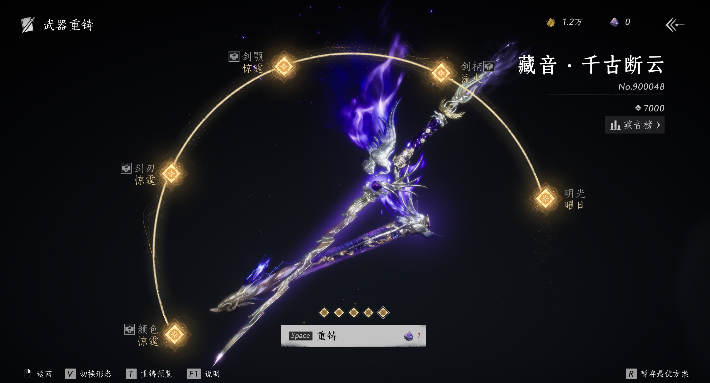

## 前言

在主流 MMO 和长期运营的网络游戏中，付费系统是商业收益和维持游戏持续更新的保障。不同游戏会采用不同的收费模式。例如，《魔兽世界》和《最终幻想14》这类传统 MMO 主要依靠月卡、资料片付费，以及部分商城外观内容维持长期运营。这类付费模式的特点是主要面向较广泛的普通玩家，消费门槛相对不高。大部分玩家只需要承担固定的月卡或资料片成本，就可以获得完整的核心游戏体验。虽然这类游戏中也存在外观商城和额外付费项目，但它们整体上并不依靠数值强度或高额消费来刺激玩家持续投入。与之相比，有的游戏，例如《暗黑破坏神：不朽》则依赖数值付费。它们可能通过角色、武器、装备强化、宝石、坐骑属性、战力排行等方式制造消费目标。玩家付费的直接目的是提升战斗能力、提高养成效率，或者在排行榜和高难内容中获得优势。这类系统的商业逻辑较为直接：玩家通过付费获得更强的数值表现，而游戏则通过不断推出新的强度目标维持消费循环。

《燕云十六声》选择的路线则有所不同。它主要通过外观、武器皮肤和特效构建付费系统。这样的设计可以减少数值付费带来的公平性争议，也更容易维持游戏的基础体验平衡。然而，外观付费本身也面临明显限制。高质量时装、武器外观和特效内容都需要较长的开发周期，不能像数值成长一样持续快速扩张。即使聆音套、和鸣套等高品质外观可以卖出较高价格，它们本质上仍然是一次性消费内容。玩家购买后，这次消费很快就会结束，而新的高品质外观又需要较长开发周期。

因此，当常规外观内容逐渐被核心玩家消费后，游戏需要新的方式来扩大付费空间。高氪玩家有专门面向他们的高端玩法和高额消费内容，例如造船玩法这类偏顶层消费和身份展示的系统。但仅依靠这类玩法并不能覆盖更广泛的付费用户。对于中氪及以上玩家来说，游戏还需要一种门槛不至于过高、但又能够持续投入的长期消费目标。在这种背景下，武器重铸系统就是《燕云十六声》在外观内容产能有限情况下推出的一套付费空间扩展系统。它将武器拆分为颜色、不同部分的形状与特效等多个可变化元素。玩家获得武器后，还可以继续通过重铸来改变武器外观进而持续消费。这样一来，游戏不需要持续高频率生产全新的完整外观，也可以在相对有限的开发资源下，通过不同武器元素的组合变化，建立一套长期的营收模式。

因此，本文将以《燕云十六声》的武器重铸系统为例，分析其如何在外观内容产能有限的情况下拓展新的付费空间。文章将先讨论系统定位与目标用户，再分析重铸机制和设计目的，随后讨论社交展示、销金窟交易、御武兑换和累充奖励等系统如何进一步放大消费动机，最后总结其商业成效、玩家体验与后续维持吸引力的方向。

## 1. 目标用户与系统定位

在分析武器重铸系统之前，需要先说明本文对玩家消费层级的划分。游戏运营方会根据玩家累计消费金额对用户进行分层。例如在《燕云十六声》中，部分玩家会因为消费金额不同而被不同等级的客服服务，例如较低档位的燕景、更高档位的江墨、宁萌，以及更顶层消费玩家对应的诗诗。这种划分方式虽然能反映玩家的累计消费能力，但它较为笼统，并不适合直接用来分析武器重铸系统。为了更清楚地讨论不同类型玩家在武器重铸系统中的体验差异，本文将根据玩家在外观和武器系统中的消费习惯进行分类。因此，本文的分类带有一定的主观性和局限性。

- 首先是中低氪玩家。这类玩家已经有一定消费基础，通常可能拥有一到两把武器，也会购买几套自己特别喜欢的高品质时装。但他们不会长期追逐所有高品质外观。如果后续推出的高品质衣服不是特别喜欢，他们通常不会继续消费。武器方面也是类似逻辑：如果不是自己常用流派相关的武器，他们一般不会继续购买或深度重铸。
- 其次是中氪玩家。这类玩家的外观消费意愿更强，通常会拥有大多数高品质衣服。如果一套外观有一个明显吸引点，例如设计风格、发型、特效部位或结算动画比较好，他们就比较容易购买。武器方面，他们可能会拥有几把自己喜欢的武器，或者几把和自己常用流派相关的武器。
- 再往上是中高氪玩家。这类玩家除了船套这类顶层消费内容以外，其他高品质衣服基本都会拥有。武器方面，他们不只是购买自己常用流派的武器，也可能因为某把武器本身好看、特效足、展示价值高，而购买或重铸一些自己并不常用的武器。
- 最后是高氪或顶层消费玩家。这类玩家的消费重点已经不只是某一把武器是否值得，而是整体身份展示和稀有资源拥有。他们可能拥有船套、高档外观和大量武器，武器重铸时也更接近随自己心意洗，不会像普通玩家一样严格受预算限制。

基于这种分层，武器重铸系统可以被描述为一个主要面向中氪及以上玩家，同时能够向中低氪玩家产生一定吸引力的高级外观消费系统。它的设计定位是为已经有一定外观消费基础的玩家提供额外的付费空间。

## 2. 重铸系统机制与设计目的

与普通外观系统不同，普通外观在购买后就已经确定最终效果，玩家消费后不会再发生变化。而武器重铸系统中，玩家获得武器后仍然可以继续通过重铸改变武器不同部位的颜色、样式和特效，并最终组合出不同的外观。因此，获得武器并不是消费的结束，而是后续消费的开始。

### 2.1 重铸系统的基本机制

重铸系统的流程基本可以描述为：

- 兑换武器。在重铸开始前，玩家需要先使用一颗八音窍兑换对应武器。八音窍分为绑定和非绑定两种，二者都可以用于兑换武器，区别在于后续交易：使用绑定八音窍兑换的武器不能在销金窟售卖，使用非绑定八音窍兑换的武器则可以在完成重铸后进入销金窟交易。
- 重铸结果。获得武器后，玩家进入重铸系统开始重铸。重铸主要消耗的材料是太一玄石。每次重铸都会消耗太一玄石，并推进孔位解锁或刷新已开启孔位的结果。武器重铸一共有五个孔位，分别对应颜色、三处结构样式和明光(整体光效)。三处结构样式按照开孔顺序依次是武器主体结构样式与特效(大面积)，武器次要结构样式与特效(小面积)，以及武器装饰性结构与特效(微小面积)。每个结果位都会随机出现蓝、紫和金三种品级，概率分别为 82%、15% 和 3%，金的保底次数为 90 次[1]。
- 开孔次数。武器初始开放第一个孔位，后续孔位需要通过重铸逐步解锁。在不锁孔的情况下，每次重铸消耗 1 个太一玄石。每经过 30 次重铸，系统会保底解锁下一个孔位，因此从第一个孔位到第五个孔位全部开启，最多需要 120 次重铸。不过，开孔过程并不是只能按 30 次、60 次、90次、120 次逐步推进，中途也可能出现暴击开孔，即跳满当前阶段的一小段进度条，直接跳到下一个孔。
- 锁孔机制。重铸系统还提供锁孔机制。已经洗出的部分孔位可以被锁定，锁定后继续重铸时，该孔位结果不会被刷新。但锁孔机制会增加后续重铸消耗。重铸说明中提到，系统允许锁定三个孔位，锁定一个、两个、三个孔位时，分别需要消耗 2 个、5 个、10 个太一玄石。此外，系统允许玩家手动保存一个重铸方案，并会自动保存多次重铸中的五个最佳方案，方便后续回退使用。

因此，重铸系统并不是一个固定流程。系统只提供开孔、随机品质、锁孔和方案保存等规则，但具体怎么洗，需要根据当前孔位结果和预算成本来决定。即使最终都洗成五金武器，不同的重铸过程也会带来很大的成本差异。

*图 1：武器重铸系统中的五孔位结果示例。

### 2.2 重铸系统的设计分析

重铸系统的第一个设计重点，是孔位开放顺序。武器重铸的外观部位按照颜色、主体结构、大面积特效、次要结构、小面积特效等顺序逐步开放。这个顺序本身具有一定的引导作用，也降低了玩家进入重铸系统的心理门槛。前期孔位对整体观感的影响比较明显，即使投入不高，也能看到较强的外观反馈。颜色是最直观的外观差异，玩家只要洗出一个喜欢的颜色，就能让武器和原本外观产生明显区别。对于预算有限的中低氪玩家来说，只追求一个满意颜色，或者进一步打开主体结构和大面积特效，就已经可以让重铸武器根据个人偏好形成一定特色。按照单个太一玄石 20 元计算，如果再考虑最高档充值返利，单个石头的实际成本可以粗略按约 16 元估算。在这种情况下，前期少量重铸或获得双金结果的成本并不算特别高，但视觉反馈已经比较明显，并和普通固定外观形成了较高区分度。而对于中氪及以上玩家来说，前期孔位只是开始。随着孔位逐渐打开，后续目标会从“有没有明显变化”变成“能不能洗出更完整、更高品质的组合”。虽然后面一些孔位对武器整体外观和特效的提升没有前期孔位那么强，但它们会影响武器的完整度和稀有度。因此，孔位顺序既照顾了中低氪玩家的低成本尝试，也给中高氪和高氪玩家留下了继续追求多金、四金、五金的空间。

第二个设计重点是锁孔机制。锁孔的作用是保留已经洗出的结果，让后续重铸不会覆盖这个孔位。这个机制给了玩家更多控制感，因为玩家不需要每次都从头开始赌全部结果。锁一个孔时，单次重铸消耗只增加到 2 个太一玄石，这对预算有限的玩家仍然有一定吸引力。如果玩家已经洗出了满意的颜色或关键部位，就可以用相对较低的成本保留它，再继续尝试其他孔位。但当锁孔数量增加时，成本会上升得很明显。锁两个孔和三个孔时，单次重铸分别需要 5 个和 10 个太一玄石。这个设计实际上把不同消费层级区分开了。锁一个孔更可能是给中低氪玩家一个继续尝试的入口，而多孔锁定则更面向已经有明确目标、愿意继续投入的玩家。当玩家已经投入较多材料，并且已经洗出部分满意结果时，这些已有结果本身也会形成沉没成本。此时继续洗虽然成本更高，但放弃又会显得前面的投入没有完全转化成理想结果，于是玩家更容易继续重铸，直到接近自己的预算上限或目标结果。

第三个设计重点是套装和特殊搭配。对于一般玩家来说，五金武器已经是一个终点。但对于高氪玩家来说，单纯的五个孔位都是金色并不是终点。因为前四个孔位中还存在不同的套装结果，金色品级本身的概率是 3%，但如果进一步要求某一个特定套装，实际目标概率会被继续拆分。例如，两款套装时，金色结果可能分别占 1.5%；三款套装时，不同套装的概率还会继续细分。也就是说，追求出金和追求出指定金色套装并不是同一个难度。这个设计主要面向高氪玩家。因为他们追求的是稀有度、完整度和展示价值。多个孔位同属一个套装，或者特定孔位之间形成的特殊搭配，例如凤求凰这种特殊组合，都会让武器从普通五金进一步变成更稀有的展示品。目标越具体，所需重铸次数就越多，成本也越高。对高氪玩家来说，这种需要高消费的低概率结果本身就是区分度的一部分。

因此，重铸系统通过孔位顺序、锁孔费用和套装概率，把不同预算的玩家放进同一套系统里。中低氪玩家可以用较低成本获得颜色或关键特效带来的明显变化，中氪玩家可以继续追求多金和更完整的武器效果，而高氪玩家则可以追求套装、特殊搭配和更稀有的组合结果。这样一来，同一把武器就被拆分成了多个层级的消费目标，成为了一个覆盖不同付费层级、并持续拓展外观付费空间的系统。

## 3. 其他系统与重铸系统的联动

武器重铸系统并不是孤立存在的。玩家洗出一把重铸武器后，这把武器还会进入社交展示、销金窟交易、御武值和累充奖励等其他系统。这些系统会进一步放大重铸结果的价值。它们一方面满足玩家的展示欲、身份感和优越感，另一方面也通过市场交易、阶段奖励和长期目标，刺激玩家保持上线或继续消费。因而，这一章主要分析重铸系统和其他系统之间的联动关系。

### 3.1 重铸武器的展示价值

武器重铸的价值不仅在于武器本身好不好看，也在于它能不能被其他玩家看到。对于外观消费玩家来说，重铸武器首先是一种审美选择。颜色、结构样式、特效和套装搭配越明显，武器就越容易和普通外观拉开区别。尤其是多金、五金、套装或特殊搭配武器，本身就带有身份象征意味，可以让玩家和一般玩家形成区分，并获得更强的优越感。这种展示价值会在游戏中的多个场景被继续放大。重铸武器后，玩家可以在副本、战斗、结算动画、大世界社交场景，甚至后续开发的家园系统中展示出来。此时，重铸武器成为了一个可以被其他玩家识别和评价的公共展示内容。当展示场景越多，武器的存在感就越强，玩家继续重铸其他武器的动机也更容易被放大。因此，社交展示让武器重铸的价值从个人审美扩展到身份表达。武器特效越明显或者越稀有，它在公共场景中的展示价值就越高。这也是重铸系统能够继续刺激消费的重要原因之一。

### 3.2 当重铸武器变成商品

销金窟让重铸武器进入玩家之间的自由交易。对于零氪或低氪玩家来说，这提供了一种间接参与重铸武器系统的方式。即只要他们愿意花时间做菜、赚取宝钱，也有机会从销金窟中购买其他玩家洗好的重铸武器成品。由于做菜需要消耗体力，而体力存在上限，长时间不使用就会溢出。因此，玩家如果想通过做菜稳定积累宝钱，就需要定期上线消耗体力。这样一来，销金窟不仅扩大了重铸武器的参与范围，还一定程度提高了玩家的日常上线动力。

对于愿意重铸武器的玩家来说，销金窟首先会鼓励他们使用非绑定八音窍兑换武器。因为只有使用非绑定八音窍兑换的武器，后续才可以进入销金窟售卖。也就是说，销金窟实际上促使玩家主动抽取非绑定八音窍，这会带来更直接的消费。此外，销金窟也提供了一定的容错空间。如果玩家洗出一把品质较高但自己并不喜欢的武器，就可以选择出售，再用获得的宝钱购买更符合自己审美的武器。这使得重铸结果不至于完全浪费，对玩家来说相对友好。尤其是在五金武器这类高成本结果中，如果最终效果不是自己最想要的搭配，销金窟至少提供了一个转手和换取其他武器的渠道。

但销金窟也带来了明显的问题。由于市场中存在大量成品武器，玩家会自然比较自己洗的成本和直接买的价格。如果一把五金成品的市场价格低于玩家自己重铸所需的预期成本，那么玩家就会觉得自己洗不如直接买。这会削弱一部分中低氪和中氪玩家继续重铸的意愿，使他们更倾向于通过宝钱购买成品。同时，销金窟的价格波动也会影响玩家体验。热门、好看或有收藏价值的武器更容易卖出，而一些外观吸引力不足和收藏价值不高的武器，可能很快贬值，以至难以卖掉。对于中低氪和中氪玩家来说，这会放大消费风险：他们既担心自己洗武器成本过高，也担心洗出来后无法以理想价格卖出。结果就是，销金窟一方面让更多玩家有机会获得重铸武器，另一方面也让重铸行为变得更像一次带有市场风险的消费选择。

总体来看，销金窟对重铸系统是有利有弊的。它扩大了重铸武器的流通范围，也给低消费玩家提供了获取成品的机会；但同时，市场价格和实际重铸成本之间的不匹配，又会降低部分玩家亲自重铸的动力。尤其是当成品价格下跌、武器转手困难时，玩家会更容易感到消费体验不佳。

### 3.3 阶段性目标刺激重铸消费

除了展示和交易以外，御武兑换系统也进一步强化了重铸武器的消费动机。这个系统将武器获取和重铸投入转化为两种进度资源：御武值和御淬值。玩家兑换一把武器本体可以获得 400 点御武值和 2000 点御淬值，每消耗一颗太一玄石进行重铸，则可以获得 4 点御武值和 20 点御淬值。其中，御武值主要用于解锁更高等级的商店，御淬值则用于购买商店中的商品。

这个设计的关键在于，它为玩家设置了阶段性目标。御武兑换商店会在 1000、4000、10000 御武值等节点解锁后续商店，而每个阶段中都放入了具有吸引力的商品。这样一来，玩家重铸武器时获得的还包括向下一个商店等级推进的进度。即使玩家暂时没有洗出最理想的武器结果，御武值和御淬值也会让这次投入显得没有完全浪费，因为它同时推动了另一个奖励系统的进度。其中，10000 御武值对应的神机商店尤其明显。它和上一个商店之间跨度很大，并且商店中的动作具有较强展示价值，可以在大世界中让其他玩家互动参与，因此更容易形成身份感和稀有感。这个目标不仅是一个长期目标，它更像是刺激中氪玩家继续重铸的阶段性消费目标。

以中氪玩家为例，如果他们已经拥有主武流派、副武学流派以及常用弓箭等大约五把重铸武器，并且每把武器都洗到普通五金水平，那么御武值大致可以达到 7000 点左右。这个估算基于每把武器本体提供 400 点御武值，以及每把武器约消耗 250 个太一玄石、每个太一玄石提供 4 点御武值。也就是说，五把武器大约可以带来 7000 点御武值。此时玩家距离 10000 御武值还有一段距离，但已经不是完全遥远的目标。随着第二轮重铸武器推出，御武兑换系统也在这一时间点推出，这实际上给了这部分玩家一个继续消费的理由：如果再重铸几把新武器，就会达到 10000 御武值，解锁最后一档商店。

因此，御武兑换系统的刺激点在于它把重铸投入变成了可累计、可量化的进度。玩家每多洗一把武器，每多消耗一些太一玄石，都在向下一档奖励靠近。与此同时，御武值也提供了一种比“五金武器”更直接的投入证明。因为五金武器本身带有较强随机性，有些玩家可能运气很好，用较少的成本就洗出理想五金；也有玩家可能投入很多太一玄石，才得到同样的五金结果。因此，单看一把五金武器，并不能完全判断玩家到底投入了多少。但御武值和武器本体数量、太一玄石消耗量直接相关，玩家的御武值越高，基本就意味着他在武器获取和重铸上投入越多。也就是说，御武值把原本隐藏在重铸过程中的消费投入，转化成了一个更直观的量化指标。尤其是高等级商店和其中的稀有奖励，本身就会向其他玩家传达一种信息：这不是单靠一次运气就能获得的结果，而是长期投入和高额消费的体现。对于已经有多把武器、但还没有达到顶层消费水平的中氪玩家来说，这种差一点就能解锁下一档的设计，会明显放大继续重铸的动机。它让御武兑换商店里的奖励成为身份展示的一部分。玩家不只是为了某一把武器继续重铸，也是在通过御武兑换商店里的奖励证明自己的投入水平。

类似的逻辑也出现在周年累充奖励中。周年期间推出的高额累充奖励，例如 20 万档位的高品质外观，在特定时间节点刺激中高氪玩家继续消费。它和御武兑换系统的共同点在于，二者都把消费行为转化成了一个可追逐的目标：御武兑换系统通过御武值、御淬值和商店解锁，引导玩家在后续重铸中继续积累进度；累充奖励则通过高档位外观，推动玩家进行消费冲刺。前者更绑定重铸进度，后者更绑定累计消费，但它们都在单次外观消费之外，为玩家提供了继续投入的理由。

## 4. 总结与后续方向

从商业角度看，武器重铸系统的优势在于用有限的产能资源拓展了外观付费空间。它把原本一次性购买的武器外观，拆分成多个可追求的目标。配合社交展示、销金窟交易、御武兑换和累充奖励，重铸武器被转化为长期消费内容。但从玩家体验来看，这套系统的代价也很明显。重铸成本高、随机性强，保底也不等于满意结果；锁孔虽然提供了一定控制感，但会显著提高后续成本；销金窟虽然允许交易和转手，却也带来了价格波动、武器贬值和卖不出去的风险。再加上社交展示和阶段奖励带来的比较压力，玩家很容易在继续投入和及时止损之间产生焦虑。

后续要维持重铸系统的长期吸引力，可以从持续制造新的消费理由入手。首先，御武兑换系统可以继续提供后续奖励，让已经达到一定御武值的玩家仍然有新的追求目标；累充系统也可以继续推出高吸引力奖励，在特定节点刺激玩家消费，并强化玩家对后续高档奖励的期待。这样可以让重铸投入继续和身份展示绑定。其次，武器重铸本身需要继续提升外观吸引力。后续武器可以从整体光效和新一代画面表现入手，让新武器和旧武器之间形成明显差异。玩家愿意继续重铸的前提是新武器本身足够好看，并能够带来新的展示价值。此外，重铸武器还可以和高品质时装形成风格联动。通过颜色、主题、特效风格和展示动作上的搭配，让玩家为了完整外观效果同时关注武器和时装。这样一来，武器重铸不只是单独卖武器，也可以带动时装消费，形成外观内容之间的互相带货。同时，销金窟也需要避免重铸武器过快贬值，尤其是五金武器这类高成本外观。如果市场最低售价过低，或者贬值速度过快，就会削弱玩家亲自重铸的意愿。因此，系统可以通过最低售价限制等市场调节方式，在一定程度上维持五金武器的基本价值。最后，在游戏进入后期，整体外观消费吸引力开始下降时，也可以通过活动投放少量太一玄石，或者增加一些免费获取途径，引导玩家重新进入重铸系统。总的来说，维持重铸系统吸引力的关键是持续提供新的外观刺激、阶段奖励和进入理由。

## 参考资料

[1]《燕云十六声》，《燕云十六声》游戏内概率公示，https://www.yysls.cn/news/update/20250106/40412_1204508.html